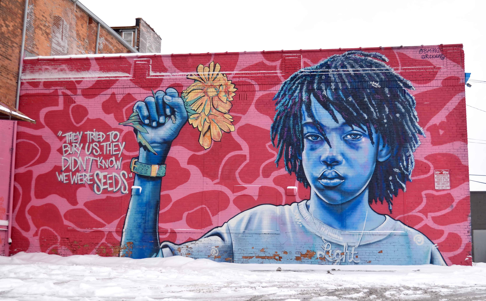
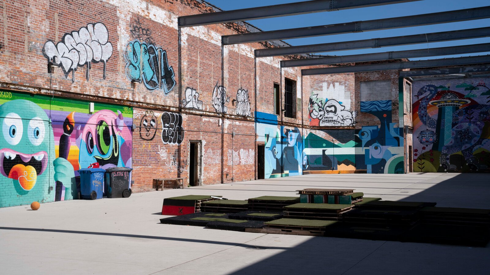
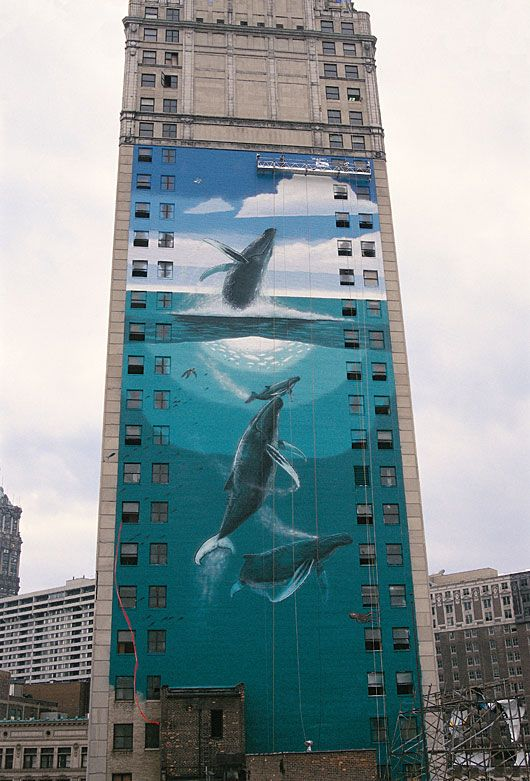
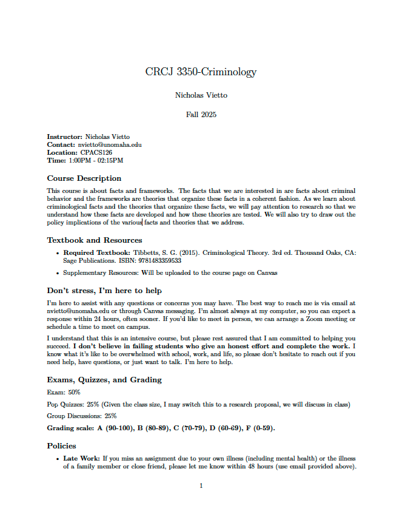
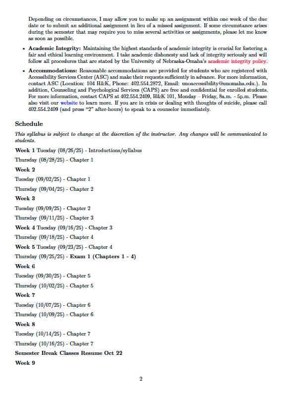
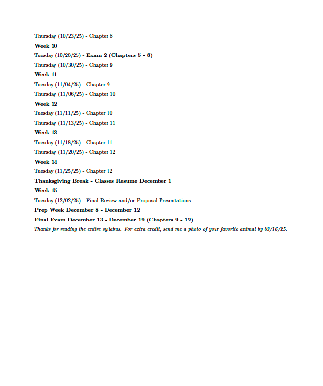

# Introductions

# I'm Nick!

A PhD Candidate in the College of Criminology and Criminal Justice at UNO.

:::{.smaller-text}

[**Research Interests:**]{style="color:#859ab2;"} Applied Statistics 

[**Teaching:**]{style="color:#859ab2;"} I have taught all over 👨‍🏫

[**Where I'm from:**]{style="color:#859ab2;"} Detroit, Michigan 🦁

[**Somethings about me:**]{style="color:#859ab2;"} I just beat Expedition 33 (Best game everrrrr). If you see me in headphones I'm prob listening to Lorde or Lana Del Ray 🤷

[**Things I love about my hometown:**]{style="color:#859ab2;"} Street Art and Graffiti

:::

## 

{.absolute top=0 left=20 width="65%"}

{.absolute top=450 left=400 height="35%"}
{.absolute top=450 left=-150 height="35%"}

{.absolute top=100 left=850 height="80%"}

# Your turn!

**Your name?**

 

**Year and Career Interests?**

 

**Somethings about you?** 

 

**Something you might miss about your hometown or something you want to share about it?**

# Syllabus

Tues., Thurs. / 1:00PM - 02:15 PM/  CPACS126

::: r-stack

{.fragment width="400"}

{.fragment width="400"}

{.fragment width="400"}

:::

## Class Structure

- Slides will be available on Canvas (Files/Lecture Slides) after we cover each chapter. 
- Everything you [*need*]{style="color:#859ab2;"} to know is **not** in the slides
- Each lecture will be conducted with open discussion and participation is expected. 
- We will have group discussion ~ 1-2 times a chapter!

## How will you be Graded?

-  Exams (multiple-choice and writing) (50%)

-  Pop Quizzes (multiple-choice) (25%) (Or do we want a research proposal with a presentation?)

-  Discussion Groups (25%)

- Hint: if you see something in [color]{.aqua} in a lecture slide, it's likely important to your exam

## My Expectations

-   [**Read**]{style="color:#859ab2;"}

-   [**Show up to class**]{style="color:#859ab2;"}

    -   This material is cumulative (i.e., it snowballs) and missing lectures will impede your understanding of the material  
    
    -   If missing class is unavoidable, let me know.

-   [**Participate**]{style="color:#859ab2;"}

## Participation & Climate

-   Inclusive environment
    -   This class can & should be a place for [*active*]{style="color:#859ab2;"} discussions. This is where learning ['comes to life.']{style="color:#859ab2;"}
-   Consider the discussion ['space']{style="color:#859ab2;"} you take up
    -   Allow others to speak.
        -   If you find yourself taking up most of the discussion, take a break & give room for others to participate.
    -   This space is for all of us.

## Office Hours

-   A couple options:

    -   Talk to me after class

    -   We can set up a time on Zoom

## Technology in the Classroom

[Attention is Key]{.blue}

::: {.small-text}

[Learning requires intense focus.]{.violet} Concentrating without distractions strengthens specific brain circuits, which helps solidify skills.
    
Engaging in multitasking or 'task switching' can hinder learning by overloading your brain with competing stimuli.

:::

[Note-Taking Practices]{.blue}

::: {.small-text}

While computers are permitted for note-taking, [I strongly encourage using a notebook]{.orange}. Handwriting notes can [enhance focus and retention]{.green}.

:::

[Device Etiquette]{.blue}

::: {.small-text}

Phones should be [turned off or kept in your bag]{.aqua} during lectures to avoid distractions.

During group discussions, [neither computers nor phones]{.red} will be allowed to ensure active participation and engagement.

:::

## Questions? {style="text-align: center"}

::: footer

image: giphy

:::

# Have a great day! 

