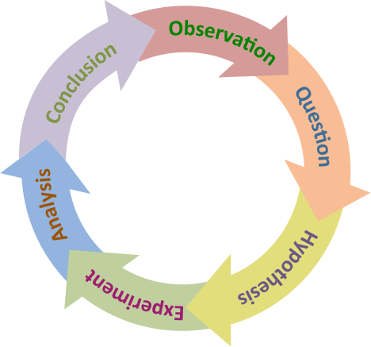
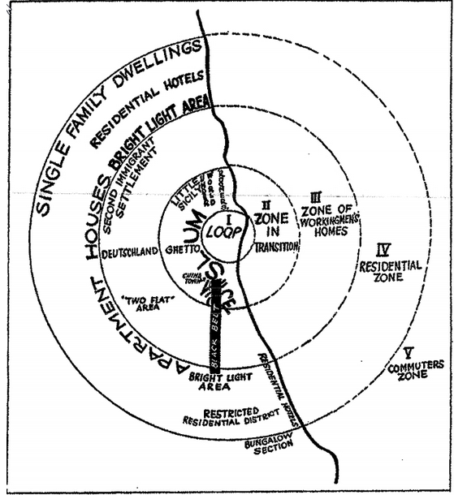
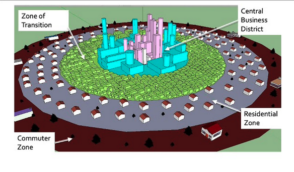
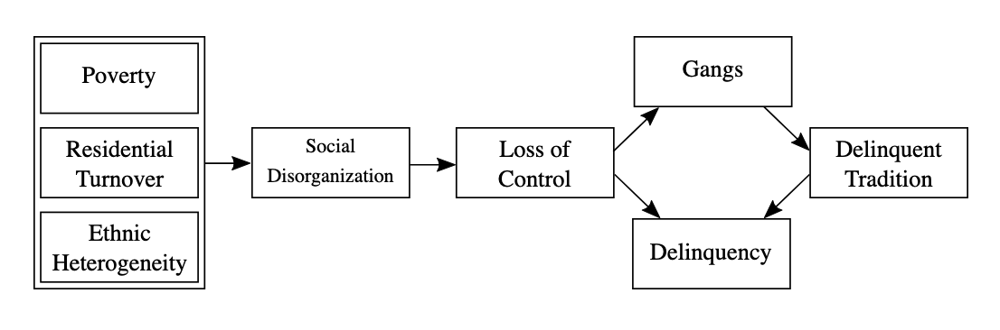

---
format:
  revealjs: 
    theme: styles.scss
    incremental: true 
    slide-number: true
    embed-resources: true
    self-contained: true
    show-notes: false
    preview-links: true
    transition: fade
---

```{r}

library(countdown)

```

#

::: {.title}

An Overview of Issues in Criminological Theory 

:::


## What is Criminology? 

The [**scientific** study of why people commit crime and why some places have more crime than other places]{.blue}

* How does a journalistic perspective on crime differ from a criminologist's perspective?  
(hint: starts with an [**s**]{.blue})

::: {.incremental}

1. The criminologist perspective relies on the [**s**cientific method!!!]{.blue}

2. Journalist rely on *one incident of crime* and then make inferences but criminologist rely on many many *many incidents of crime (Think in the thousands!!!)*
 
:::

::: notes


How do we typically encounter information about crime in society?

Talk about the importance of what you see on the news (journalistic) vs. what criminologist actually do


:::


::: {.center}

## Okay, but how do we go from the journalistic perspective to the criminologist perspective?

:::

#

{fig-align="center"}


::: footer

image: giphy

:::

## Scientific Method 

{fig-align="center"}

::: notes

**Observation:**
Identify a phenomenon or a specific problem that sparks curiosity.

**Question**
Formulate a clear, focused question based on the observation.

**Hypothesis**
Develop a testable and **falsifiable** statement that provides a possible explanation.

**Experiment**
Design and conduct experiments to test the hypothesis.  
Collect data systematically.

**Analyze**
Examine the data to determine whether it supports or contradicts the hypothesis.

**Conclusion:**
Decide if the hypothesis is supported, needs revision, or should be rejected.

Then... 

**Replication** and **Communicate**


Ask for an example to work through on the board (e.g., plants grow in sunlight? )


:::


## What is a Theory? 

[**A set of concepts linked together by a series of statements to explain why an event or phenomenon occurs.**]{.blue}

<br>

In other words, they explain how and why the world works the way it does!  

<br>

Famous examples: *Theory of Relativity*, *Germ Theory of Disease*, *Theory of Evolution*, *Self-Control Theory*

<br>

Criminology has a lotttt of theories and we'll discuss quite a few in the upcoming lectures.


# Group Discussion!!! 

##  Group Discussion!!! 


```{r}
countdown::countdown(minutes = 5,
                    color_border = "#FF7F50",
                    color_text = "#859ab2",
                    color_running_text = "white",
                    color_running_background = "#859ab2",
                    color_finished_text = "white",
                    color_finished_background = "#FF7F50",
                    top = 0,
                    margin = "0.2em",
                    font_size = "2em")
```


<br>

<br>

Within your group, discuss and reach a consensus on [what the factors, or your group's theory, that explains:]{.blue} [the relationship between economic hardship and criminal behavior.]{.orange}


<br>

Elect one speaker to present your point.


::: notes

Go back and forth once they have a speaker, increase discussion amoung other groups 

write examples of economic hardship on board: 

**Families struggled to afford basic necessities such as food, clothing, and shelter.**

**Growing disparities in income and wealth wihtin minority communities can exacerbate feelings of injustice and marginalization, potentially leading to higher crime rates.**


:::


## Social Economic Status (SES)

<br>

::: {.small-text}

An [individual’s or family’s social and economic position]{.orange}, commonly measured by income, education, and occupation.

<br>

SES [can vary]{.blue} (⬆️ or ⬇️) substantially across communities. For example, significant differences exist between neighborhoods in North and West Omaha.

<br>

[Individuals from minority groups or recent immigrant families often face lower SES]{.orange} due to [historical inequalities and ongoing structural barriers such as racism and discrimination.]{style="text-decoration: underline;"}

:::


## Social Disorganization Theory

::: {.small-text}

This attributes [variations in crime rates to the structural and cultural characteristics of communities.]{.blue}

<br>

It suggests that a community’s capacity to maintain social order and prevent criminal behavior depends on [informal social controls - social cohesion and collective efficacy]{.orange} - supported by [structural stability (e.g., residential stability, low turnover)]{.blue}

<br>

Essentially, according to this theory, if these factors are ⬆️ then crime will be ⬇️

<br>


If these factors are ⬇️ then crime will be ⬆️

:::

## Social Disorganization Theory

::: {.small-text}

[Social Cohesion]{.orange}

The [strength of relationships, trust, and sense of belonging]{.blue} among members of a community.

<br>

[Collective Efficacy]{.orange}

A community’s shared belief in its [ability to work together to achieve common goals]{.blue}, such as maintaining order or promoting safety.

<br>

[Structural Stability]{.orange}
The presence of [stable social and economic institutions (e.g., family, schools, employment, places)]{.blue} that provide consistency and resilience within a community.

:::


## Burgress's Concetric Zones


::: {.columns}
::: {.column width="40%"}



:::

::: {.column width="60%"}

::: {.smaller-text}

[**Place Not Race!!!**]{.orange}

<br>

[**High Crime in the Zone of Transition**]{.blue} 

  * Population Turnover and Heterogeneity
  
  * Economic Disadvantage
  
  * Conflicting cultural norms and values
  
[**Low Crime in Peripheral Neighborhoods**]{.blue}

  * Stable, Homegenous Populations 
  
  * Higher Social Economic Status (SES)
  
  * Fewer conflicts on cultural norms or values

    
:::


:::

:::

::: footer

image: UW Sociology

:::

::: notes

Go back and forth with the zones relative to omaha. Use the board

*Chicago's urban neighborhoods in the 1920s*

Ernest Burgess proposed that urban areas develop in a series of concentric rings emanating from the central business district (CBD). Each zone has distinct social and economic characteristics:

**Zone 1:** *Central Business District (CBD)*

The commercial heart of the city with high land values and intense land use.

**Zone 2:** [Transitional Zone]{.blue}

Characterized by mixed residential and commercial use.
        
High population turnover, poverty, and substandard housing.
        
**Often the site of new immigrants and marginalized populations.**

**Zone 3:** Working-Class Residential Zone

More stable residential areas with working-class families.

*Lower crime rates compared to the transitional zone.*

**Zone 4:** Residential Zone

Middle-class neighborhoods with better housing and amenities.

**Zone 5:** Commuter Zone

Suburbs inhabited by affluent residents who commute to the CBD for work.


**Zone 2 was the major inspiration behind social disorganization theory!**

:::

## Burgress's Concetric Zones




::: footer

image: youtube
:::


## Social Disorganization


Areas like the **zone in transition (zone 2)** often experience higher crime rates due to [poverty]{.blue}, [residential turnover]{.blue}, and [ethnic heterogeneity]{.blue}, which leads to weakened social controls.



::: footer

image: UW Sociology

:::

::: notes

Social controls, informal (e.g., church groups, workplace ties, community meetings/clubs) and formal (e.g., laws)

the disorganization (social cohesion, collective efficacy, and structural stability) leads to......

*The community’s inability to maintain social order and prevent criminal behavior. For example the behaviors that come from: unmonitored youth groups, gangs, financial crime, bars, etc...*

:::

## Recap!!

* Scientific Method

<br>

* Theory

<br> 

* Social Disorganization Theory 


## What is Crime? 


::: footer

image: CSI.net

::: 

::: notes

Let students answer


::: 

## What is Crime? 


[An act or omission that **violates the laws established by a governing authority** and is punishable by the state or another authorized entity.]{.blue}


::: {.smaller-text}

Crimes are generally categorized based on their **severity and nature**, including:

* **Felonies**: Serious offenses such as murder, rape, or armed robbery, often punishable by imprisonment for more than a year or even the death penalty in some jurisdictions.  

* **Misdemeanors**: Less severe offenses such as petty theft or vandalism, typically punishable by fines, community service, or imprisonment for less than a year.  

* **Infractions**: Minor violations like traffic offenses or public disturbances, usually resulting in fines.  

* The legal definition of crime varies across jurisdictions but often involves two essential components: [**Mala in se** & **Mala prohibita**]{.orange}

:::

## Mala in se

<br>

*"Evil in itself"*


* [Acts considered inherently immoral, evil, or wrong by their very nature, regardless of whether they are prohibited by law.]{.blue}


* Examples?

<br>

* Murder, rape, robbery, assault, etc..

::: notes

Mala in se & Mala prohibita stem from Roman law ~ the 5th century.    

Was then extended and carried out throughout medieval time and had substantial influnece on English Common Law in the 12th and 17th centuries


:::


## Mala prohibita 

<br>

*"Evil because prohibited"*


* [Acts that are not inherently immoral but are deemed illegal because they violate a statute, regulation, or law established by governing authorities.]{.blue}


* Examples?


<br>

* Speeding, cheating on taxes, *prostitution*, *gambling*, *drug-use*, etc.. 

::: notes

What's different about the final three above?

Some states allow these, while others don't. This is the essence of mala prohibita 

::: 


## How Are Criminological Theories Classified?

Criminological theories are categorized based on their [core concepts, assumptions, and characteristics]{.green}, which typically align with broader [paradigms]{.violet}.

<br>

A [paradigm]{.violet} refers to a universally recognized set of concepts, theories, methods, and standards that define a scientific discipline during a particular period.

<br>

Famous Examples: *Copernican Paradigm*, *Newtonian Paradigm*, *Darwinian Paradigm*


::: notes 

Copernican Paradigm

Challenged the model that the earth was the center of the solar system

Newtonian 

"Apple fell on his head at cambridge under a tree"

Led to the development of classical mechanics, including the laws of motion and gravity. 


In essence, these are major discoveries that let to what is a called a **paradigm shift**, which is a major change in the understand of a phenomena 


:::


# The Four Major Paradigms 

## Classical School

[Free Will and Rational Decision-Making]{.blue}

[Individuals possess free will and choose to commit crimes through rational decision-making.]{.green} This involves weighing the potential costs and risks against the benefits (i.e., maximizing pleasure and minimizing pain).

<br> 

[Foundations of Deterrence and Rational Choice Theories]{.blue}

The Classical School emphasizes the [importance of deterrence and the role of rational choice]{.green} in understanding criminal behavior.

* Any problems with this perspective? 

::: notes

This theory implies that every individual is capable of a "rational choice." 

Although, mental health, desperate economic conditions, and other factors can dissuade individuals from having a rational viewpoint, either wihtin a moment or over an extended period of time. 

With this framework in mind, what's one massive problem that occurred in the 80s and 90s due to deterrence theory? 

The "Tough on Crime" and "War on Drugs" policies of the 1980s and 1990s in the United States, fueled by deterrence theory.

Policymakers assumed that harsher penalties, mandatory minimums, and long prison sentences would “deter” potential criminals from breaking the law by making the costs of getting caught seem prohibitively high.

The result was an era of mass incarceration, particularly in communities of color, **without a corresponding decrease in crime.**


:::


## Positivism

[Lack of Free Will and Rationality]{.blue} 

Positivism argues that individuals [do not exercise free will or rationality when deciding to commit crimes]{.green}.

<br>

[External Influences on Criminal Behavior]{.blue}

Crime is attributed to factors [beyond an individual’s control, such as genetics, intelligence (IQ), education, economic conditions, peer influences, and other environmental or biological determinants.]{.green}


* Any problems with this perspective? 


::: notes

Can lead to loss of individual agency, undermines accountability, increase stigma and discrimination.

Specifically, early positivist criminologists like Cesare Lombroso argued that criminals had “atavistic” (primitive) traits and could often be identified by physical or biological markers. This played a role in the Social Darwinism movement and Eugenics. However, the eugenics movement was much broader, **fueled by racism, classism, and the misuse of evolutionary theory**. 

Thus, positivism was a catalyst, but not the sole driving force behind eugenics policies.

:::

## Conflict or Critical Perspectives

[Law as a Tool of Authority]{.blue} 

The law is [viewed as a reactionary tool used by those in power to enforce control and restraint over less powerful groups.]{.green}

[Focus on Groups Over Individuals]{.blue}
Emphasizes the [dynamics between social groups rather than focusing on individual behavior.]{.green}

[Key Theoretical Foundations]{.blue}

::: {.small-text}

Includes Marxist theories, feminist theories, and perspectives on the experiences of marginalized or subordinated groups (e.g., Black communities in the United States).

:::

* Any problems with this perspective? 


::: notes

Marxist theories stem from the broader work of Karl Marx, who argued that capitalist societies are characterized by an ongoing struggle between those who own the means of production (the ruling class or “bourgeoisie”) and the working class (“proletariat”). 

Marxist theories emphasize how the **capitalist structure creates and labels crime in ways that benefit the powerful and harm the less powerful**, urging us to see crime less as an individual failing and more as a byproduct of systematic inequality. (Could mention what we are seeing today in the new administration).

These perspectives can sometimes downplay the role of individual agency and decision-making. 

Not all criminal behavior is purely a reaction to oppression; personal choices and moral considerations still matter.

:::


## Integrated Theories

<br>


[Combining Explanatory Models]{.blue}

Integrated theories [merge key elements from different explanatory models into a cohesive theoretical framework]{.green}, aiming to provide a more comprehensive understanding of crime and its causes.


* Any problems with this perspective? 

::: notes

Makes theories overly complex, and threatens parsimony. 

Leads to contradictions when theories are aggregated. 

Aim to capture the multifaceted nature of crime, but in doing so, they can become unwieldy, internally inconsistent, or difficult to apply in practice.

:::

  
## Additional Classifications 

<br>

[Micro-Levels of Analysis]{.blue}

Focuses on individual behavior, decision-making, and personal characteristics.

* What paradigm aligns best here?


[Macro-Levels of Analysis]{.green}

Examines group dynamics, societal structures, and broader social patterns.

* What paradigm aligns best here?

## Characteristics of a Good Theory

::: {.smaller-text}

[*Parsimony*]{.blue}

The theory should be [simple]{.green} yet powerful, explaining phenomena with minimal assumptions.

[*Testability*]{.blue}

Must be [falsifiable]{.blue2} and allow for empirical testing.

[*Empirical Validity*]{.blue}

[Supported by research evidence]{.orange} and consistently confirmed by data.

[*Scope*]{.blue}

Explains a [wide range of phenomena]{.forest} or has a broad applicability.

[*Logical Consistency*]{.blue}

[Internally coherent]{.violet}, avoiding contradictions while explaining phenomena effectively.

:::

::: notes

Add these to the board


::: 

# Group Discussion!!! 

##  Group Discussion!!! 


```{r}
countdown::countdown(minutes = 5,
                    color_border = "#FF7F50",
                    color_text = "#859ab2",
                    color_running_text = "white",
                    color_running_background = "#859ab2",
                    color_finished_text = "white",
                    color_finished_background = "#FF7F50",
                    top = 0,
                    margin = "0.2em",
                    font_size = "2em")
```


<br>

With the four paradigms and the 'characteristics of a good theory' in mind, discuss and present which paradigm explains *violent crime* the best?

<br>

Elect one speaker to present your point.


## That's All Folks 


::: footer

image: giphy 

:::
