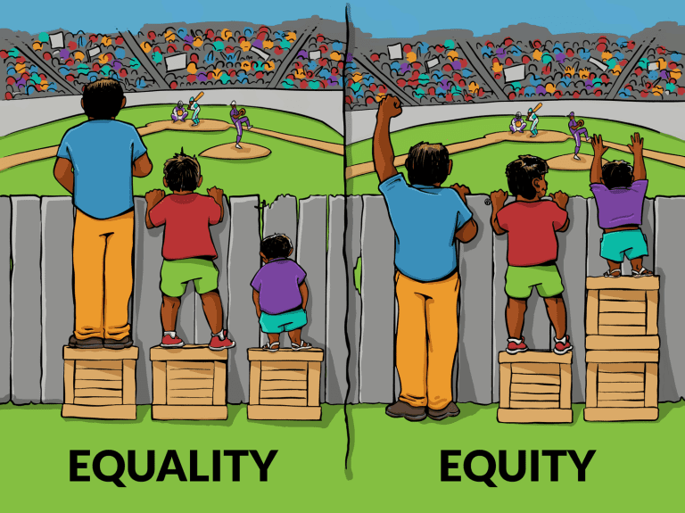

---
format:
  revealjs: 
    theme: styles.scss
    incremental: true 
    slide-number: true
    embed-resources: true
    self-contained: true
    show-notes: false
    preview-links: true
    transition: fade
---


#

::: {.title}


Feminist Models of Crime 

:::


## How did we get here? 

:::{.small-text}

<br>

1️⃣ Traditional criminology was male-centered, in other words, [all theories were about men. All data-sets contained only men participants. Ignoring the role of women]{.blue2}

<br>

2️⃣ Feminist movements [challenged patriarchal assumptions]{.blue2}, allowing for more well-rounded understanding of theory

<br>

3️⃣ [Social Reaction Theories]{.blue2} (e.g., Labeling and Marx theories) highlighted power, social definitions, and inequality, opening the door for feminist critiques

:::


## Feminism

::: {.columns}
::: {.column width="60%"}

:::{.smallest-text}

<br>

Feminism is a [broad social, political, and intellectual movement that seeks to understand and challenge systems of gender inequality]{.blue2}

<br>

Argues that [women and gender-marginalized groups face unequal access to power and opportunity, and seeks to change the social and institutional structures that create that inequality]{.blue}

<br>

Feminism is [**not** a single theory]{.orange}

<br>

It includes [multiple perspectives]{.blue} with different definitions of the problem, different explanations for gender inequality and oppression, and different strategies for addressing them

:::

:::

::: {.column width="40%"}

{.absolute top=180 right=-10 height="40%"}

:::

:::


## Feminst Movements 

:::{.smallest-text}

[First Wave (19th–Early 20th)]{.blue}

[Legal Rights:]{style="text-decoration: underline;"} 

Suffrage (voting), property, civil equality

<br>

[Second Wave (1960s–1980s)]{.blue}

[Social Inequality:]{style="text-decoration: underline;"}

Work, family, sexuality, reproductive rights

<br>

[Third Wave (1990s–2000s)]{.blue}

[Identity & Diversity:]{style="text-decoration: underline;"}

Challenged universal “womanhood,” emphasizes race, class, sexuality

<br>

[Fourth Wave (2010s–Present)]{.blue}

[Digital Activism:]{style="text-decoration: underline;"}

MeToo, intersectionality, gender-based violence, online advocacy


:::


## Intersectionality

:::{.smaller-text}

Coined in 1989 by Kimberlé Crenshaw

<br>

Explains how [multiple systems of oppression - such as race, gender, class, sexuality, and legal status - [intersect]{.blue2} to shape people’s experiences]{.blue}

<br>

It isn’t just “additive” - it’s multiplicative

<br>

Crenshaw developed the concept to [show how Black women’s experiences were overlooked when feminism focused only on gender and civil-rights movements focused only on race]{.blue}

<br>

Intersectionality built on earlier critiques from women of color, queer feminists, and global feminists who argued that a single-axis approach to inequality was incomplete

:::

## Gender Bias

:::{.small-text}

[Preconceived notions, attitudes, or actions that create advantages or disadvantages for individuals based on their gender]{.blue}

<br>

[Two types:]{style="text-decoration: underline;"}

<br>

 1️⃣ Overt Bias:
 
 *Intentional* discrimination or harassment rooted in gender-based stereotypes

<br>

2️⃣ Covert Bias:

Subtle, often *unintentional* forms of prejudice (e.g., microaggressions, assumptions about capabilities)

:::

## Liberation Thesis 


::: {.columns}
::: {.column width="50%"}
:::{.smallest-text}

Freda Adler

<br>

[As women gain social, economic, and political freedoms, they also gain access to both legitimate and illegitimate opportunities—potentially increasing female criminality]{.blue}
 
<br>

Women were traditionally confined to domestic roles, limiting their involvement in lawful and unlawful activities

<br>

Expanded rights and societal roles created new avenues in education, employment, and personal autonomy

<br>

This shift broadened women’s potential involvement in behaviors once seen as primarily “male” domains

:::
:::

:::{.column width="50%"}


{.absolute top=120 right=10 height="60%"}

:::

:::


## Key Concepts in Feminist Theory


All of the following diminish the status of females in society:

<br>

[Chivalry]{.blue}

<br>

[Patriarchy]{.blue}

<br>

[Paternalism]{.blue}

## Chivalry


::: {.columns}
::: {.column width="50%"}
::: {.smaller-text}

[A set of attitudes or behaviors that position women as in need of protection or preferential treatment]{.blue}, placing them on a metaphorical “pedestal.”

<br>

Often viewed as polite or courteous behavior [by men toward women]{.blue}

<br>

Ex. A police officer may be more inclined to release a female driver with just a warning while ticketing a male driver for the same traffic violation, reflecting a [protective or lenient attitude toward women]{.blue}

:::
:::

::: {.column width="50%"}
{.absolute top=100 right=10 height="60%"}


:::

:::

## Paternalism 


::: {.columns}
::: {.column width="60%"}
::: {.smaller-text}

[The belief that women need to be protected “for their own good,” often justifying limits on their autonomy and reinforcing dependence]{.blue}

<br>

Independence for men, dependence for women

<br>

Ex. Policies that restrict women’s roles in high-risk criminal justice positions under the assumption that [these roles are too dangerous or emotionally taxing for them, thereby limiting women’s professional opportunities]{.blue}

:::

::: {.column width="40%"}

{.absolute top=100 right=0 height="60%" width="30%"}

:::
:::


:::


## Patriarchy

::: {.columns}
::: {.column width="60%"}
::: {.smaller-text}

[A social structure in which men hold primary power and women occupy a subordinate position, sustained by male dominance in cultural, legal, and economic systems]{.blue}

<br>

Ex. Women’s [under-representation in senior leadership roles]{.blue} (e.g., police chiefs, judges) reflects patriarchal norms that reward male dominance and impede gender equality in the criminal justice system.


:::

::: {.column width="40%"}

{.absolute top=100 right=0 height="60%" width="30%"}

:::
:::
:::


## Key Concepts in Feminist Theory

:::{.small-text}

<br>


This was not an exhaustive list of the concepts that contribute to Feminist theory

<br>

There are many others and the field is rapidly expanding

<br>

Now, let's take a look at the types of research out there

:::

## Key Issues in Research 


::: {.smallest-text}

<br>


[Gender ratio]{.blue}

Focuses on why [men typically have higher reported rates of criminal offending than women]{.blue}

<br>

Explores whether traditional theories, usually based on [male samples]{.blue}, sufficiently explain women’s involvement in crime


<br>

[Generalizability]{.blue}

Questions whether research [findings on men’s criminal behavior can be applied to women]{.blue}

<br>

Female specific criminality 

<br>

Calls attention to the need for theories and data collection methods that account for [women’s unique social, economic, and cultural contexts]{.blue}

:::


::: notes

Identifying gaps in research, one would be the lack of explanation for men and women difference in offending 


:::

## Gender Ratio

::: {.columns}
::: {.column width="50%"}

:::{.small-text}
Can also be seen from the lens of what [influeces crime](https://www.dropbox.com/scl/fi/nd4mrqek6je9wvvy8i5ba/abd8694_ba_main.pdf?rlkey=sasyjdag6lwljo1bhvenw4e03&e=2&dl=0)

:::


<br>


:::

::: {.column width="50%"}


:::{.small-text}

Can be seen from the lens of [what cause or explains crime]{.blue}
:::

<br>


:::
:::


# Types of Feminism 


## Liberal (Mainstream) Feminism

:::{.smaller-text}

Earliest form of feminist thought, [which emphasizes equal rights and opportunities for women.]{.blue}

<br>

Disparities in offending between men and women are largely due to women’s [historically limited access to education, employment, and other social opportunities]{.blue}

<br>

Women seek the same rights, freedoms, and social standing afforded to men.

<br>

:::

{fig-align="center"}

## Types of Liberal Feminism

:::{.small-text}

<br>

[Classical Liberal Feminism]{.blue}

Stresses individual rights and freedoms with minimal state intervention

Argues that women’s equal participation in civil and political life can be achieved by [removing legal barriers to their freedom]{.blue}

<br>

[Welfare Liberal Feminism]{.blue}

Recognizes structural inequalities that limit women’s opportunities

Advocates for [proactive policies and state involvement (e.g., social programs, affirmative action)]{.blue} to ensure women’s well-being and equitable access to societal resources.

:::

## Example: Liberal Feminism


::: {.smaller-text}

As women gained greater access to work, education, and public life, [their opportunities for both legal and illegal activities shifted]{.blue2}

<br>

[Example:]{style="text-decoration: underline;"}

Women’s property crimes (fraud, embezzlement, shoplifting) [increased]{.blue2} alongside rising workforce participation in the late 20th century

<br>

Why This Matters:

Liberal Feminism explains gender gaps in crime [as a product of social opportunities]{.blue2}, not biological differences

:::

## Critical Feminism 

:::{.small-text}

[Critiques social structures of power and dominance]{.blue}, focusing on how institutions perpetuate inequalities tied to gender, race, class, and sexuality

<br>

Sees criminological theories as shaped by and [reinforcing patriarchal power]{.blue}

<br>

Ex: Research examining how punitive drug policies [disproportionately affect low-income women of color, revealing how both gender and race interact]{.blue} to create oppression and criminalization

:::

## Example: Critical Feminism

:::{.smaller-text}

Argues that [crime cannot be understood without examining patriarchy, power, and institutional inequality]{.blue}

<br>

[Example:]{style="text-decoration: underline;"}

Gendered patterns of intimate partner violence [reflect unequal power dynamics]{.blue} — women’s victimization risk increases when they have fewer economic, social, or legal resources

<br>

Why This Matters:

Critical Feminism highlights how [structural power imbalances shape both offending and victimization]{.blue}

:::


## Marxist Feminism 

:::{.small-text}

Combines [Marxist analysis of class and economic inequality with feminist insights]{.blue} on gender-based oppression. 

<br>

[Women’s criminality can be linked to their economic marginalization and limited resources under capitalist patriarchy]{.blue}

<br>

Views capitalist systems as [upholding patriarchal structures that exploit women’s labor (paid and unpaid)]{.blue}

<br>

Example: Studies showing that women’s involvement in crimes (e.g., theft, prostitution) often stems wage inequality, or exclusion from higher-paying jobs.

:::

## Example: Marxist Feminism

:::{.smaller-text}

Argues that women’s crime is shaped by [economic inequality produced by capitalism]{.blue} and reinforced by gendered labor roles

<br>

[Example:]{style="text-decoration: underline;"}

Women’s involvement in survival-driven offenses (theft, welfare fraud, underground economy) is linked to low wages, unpaid care work, and restricted access to economic power

<br>

Why This Matters:

Marxist Feminism shows how [class oppression and gender oppression]{.blue} combine to structure women’s pathways into crime

:::

## Post-Modern Feminism


:::{.small-text}

<br>

Challenges the idea of a [single, universal female experience and questions fixed categories like “woman” or “man,” emphasizing the fluidity of gender identity]{.blue}

<br>

[Critiques mainstream feminist theories for often ignoring race, sexuality, cultural context, and other intersecting identities]{.blue}

<br>

Ex: Analyzing how media portrayals of women who commit crimes rely on stereotypes of femininity and deviance, and showing how these portrayals differ across cultural and historical contexts

:::

## Example: Post-Modern Feminism


:::{.smaller-text}

Argues that crime and gender cannot be understood through grand theories—instead, [meanings are shaped by language, identity, and social narratives]{.blue}

<br>


[Example:]{style="text-decoration: underline;"}

Labels like “bad mother,” “promiscuous,” “hysterical,” or “victim” influence how women are viewed by courts, media, and the public, shaping outcomes such as sentencing or credibility

<br>

Why This Matters:

Post-Modern Feminism highlights how [discourses and social narratives]{.blue} construct gendered identities that affect both offending and victimization

:::


# Group Discussion!!!!

## Group Discussion 

```{r}
countdown::countdown(minutes = 10,
                    color_border = "#FF7F50",
                    color_text = "#859ab2",
                    color_running_text = "white",
                    color_running_background = "#859ab2",
                    color_finished_text = "white",
                    color_finished_background = "#FF7F50",
                    top = 0,
                    margin = "0.2em",
                    font_size = "2em")
```

:::{.smaller-text}

<br>

Chivalry, paternalism, and/or patriarchal norms shape women’s employment, advancement, and treatment within justice-sector professions (e.g., policing, corrections, courts). [What policy reforms or workplace initiatives could reduce gendered barriers and create a more equitable criminal justice workforce?]{.blue2}

<br>

Furthermore, how might [adopting a feminist perspective transform current policing strategies, sentencing practices, or prisoner rehabilitation programs]{.blue} to more effectively address gender disparities and biases?

<br>

Elect one speaker to present your argument.

:::

## Have a good day

{fig-align="center"}


::: footer

image: Giphy


:::
