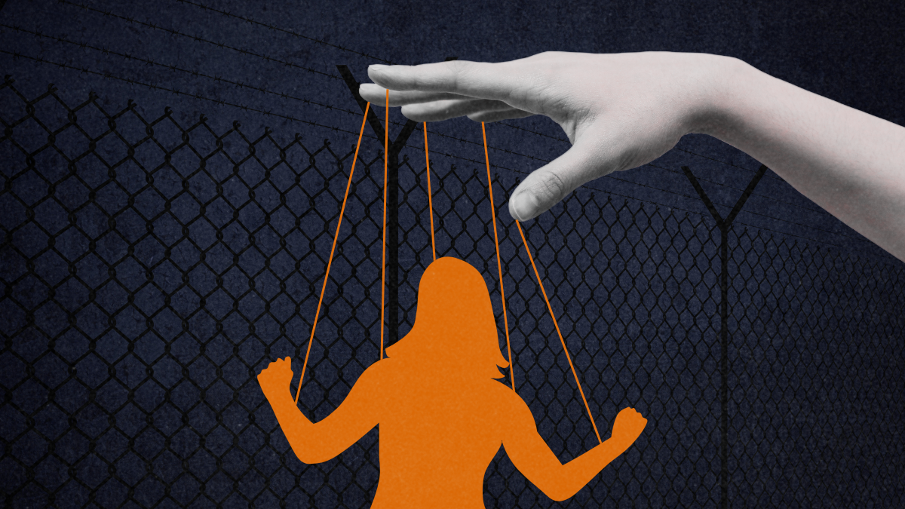
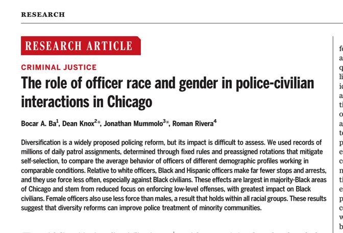
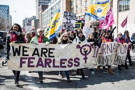

---
format:
  revealjs: 
    theme: styles.scss
    incremental: true 
    slide-number: true
    embed-resources: true
    self-contained: true
    show-notes: false
    preview-links: true
    transition: fade
---


#

::: {.title}


Feminist Models of Crime 

:::


## Gender Bias

:::{.small-text}

[Preconceived notions, attitudes, or actions that create advantages or disadvantages for individuals based on their gender]{.blue}

<br>

[Two types:]{style="text-decoration: underline;"}

<br>

 1️⃣ Overt Bias: *Intentional* discrimination or harassment rooted in gender-based stereotypes

<br>

2️⃣ Covert Bias: Subtle, often *unintentional* forms of prejudice (e.g., microaggressions, assumptions about capabilities)

:::

## Liberation Thesis 


::: {.columns}
::: {.column width="50%"}
:::{.smallest-text}

Freda Adler

<br>

[As women gain social, economic, and political freedoms, they also gain access to both legitimate and illegitimate opportunities—potentially increasing female criminality]{.blue}
 
<br>

Women were traditionally confined to domestic roles, limiting their involvement in lawful and unlawful activities

<br>

Expanded rights and societal roles created new avenues in education, employment, and personal autonomy

<br>

This shift broadened women’s potential involvement in behaviors once seen as primarily “male” domains

:::
:::

:::{.column width="50%"}


{.absolute top=120 right=10 height="60%"}

:::

:::


## Key Concepts in Feminist Theory


All of the following diminish the status of females in society:

<br>

[Chivalry]{.blue}

<br>

[Patriarchy]{.blue}

<br>

[Paternalism]{.blue}

## Chivalry


::: {.columns}
::: {.column width="50%"}
::: {.smaller-text}

[A set of attitudes or behaviors that position women as in need of protection or preferential treatment]{.blue}, placing them on a metaphorical “pedestal.”

<br>

Often viewed as polite or courteous behavior [by men toward women]{.blue}

<br>

Ex. A police officer may be more inclined to release a female driver with just a warning while ticketing a male driver for the same traffic violation, reflecting a [protective or lenient attitude toward women]{.blue}

:::
:::

::: {.column width="50%"}
{.absolute top=100 right=10 height="60%"}


:::

:::

## Paternalism 


::: {.columns}
::: {.column width="60%"}
::: {.smaller-text}

[The belief that women need to be protected “for their own good,” often justifying limits on their autonomy and reinforcing dependence]{.blue}

<br>

Independence for men, dependence for women

<br>

Ex. Policies that restrict women’s roles in high-risk criminal justice positions under the assumption that [these roles are too dangerous or emotionally taxing for them, thereby limiting women’s professional opportunities]{.blue}

:::

::: {.column width="40%"}

{.absolute top=100 right=0 height="60%" width="30%"}

:::
:::


:::


## Patriarchy

::: {.columns}
::: {.column width="60%"}
::: {.smaller-text}

[A social structure in which men hold primary power and women occupy a subordinate position, sustained by male dominance in cultural, legal, and economic systems]{.blue}

<br>

Ex. Women’s [under-representation in senior leadership roles]{.blue} (e.g., police chiefs, judges) reflects patriarchal norms that reward male dominance and impede gender equality in the criminal justice system.


:::

::: {.column width="40%"}

{.absolute top=100 right=0 height="60%" width="30%"}

:::
:::
:::


## Key Concepts in Feminist Theory


<br>


This was not an exhaustive list of the concepts that contribute to Feminist theory

<br>

There are many others and the field is rapidly expanding

<br>

Now, let's take a look at the types of research out there

## Key Issues in Research 


::: {.smallest-text}

<br>


[Gender ratio]{.blue}

Focuses on why [men typically have higher reported rates of criminal offending than women]{.blue}

<br>

Explores whether traditional theories, usually based on [male samples]{.blue}, sufficiently explain women’s involvement in crime


<br>

[Generalizability]{.blue}

Questions whether research [findings on men’s criminal behavior can be applied to women]{.blue}

<br>

Female specific criminality 

<br>

Calls attention to the need for theories and data collection methods that account for [women’s unique social, economic, and cultural contexts]{.blue}

:::


::: notes

Identifying gaps in research, one would be the lack of explanation for men and women difference in offending 


:::

## Gender Ratio

::: {.columns}
::: {.column width="50%"}

:::{.small-text}
Can also be seen from the lens of what [influeces crime](https://www.dropbox.com/scl/fi/nd4mrqek6je9wvvy8i5ba/abd8694_ba_main.pdf?rlkey=sasyjdag6lwljo1bhvenw4e03&e=2&dl=0)

:::


<br>


:::

::: {.column width="50%"}


:::{.small-text}

Can be seen from the lens of [what cause or explains crime]{.blue}
:::

<br>


:::
:::


# Types of Feminism 


## Liberal (Mainstream) Feminism

:::{.smaller-text}

Earliest form of feminist thought, [which emphasizes equal rights and opportunities for women.]{.blue}

<br>

Disparities in offending between men and women are largely due to women’s [historically limited access to education, employment, and other social opportunities]{.blue}

<br>

Women seek the same rights, freedoms, and social standing afforded to men.

<br>

:::

{fig-align="center"}

## Types of Liberal Feminism

:::{.small-text}

<br>

[Classical Liberal Feminism]{.blue}

Stresses individual rights and freedoms with minimal state intervention

Argues that women’s equal participation in civil and political life can be achieved by [removing legal barriers to their freedom]{.blue}

<br>

[Welfare Liberal Feminism]{.blue}

Recognizes structural inequalities that limit women’s opportunities

Advocates for [proactive policies and state involvement (e.g., social programs, affirmative action)]{.blue} to ensure women’s well-being and equitable access to societal resources.

:::

## Critical Feminism 

:::{.small-text}

[Critiques social structures of power and dominance]{.blue}, focusing on how institutions perpetuate inequalities tied to gender, race, class, and sexuality

<br>

Sees criminological theories as shaped by and [reinforcing patriarchal power]{.blue}

<br>

Ex: Research examining how punitive drug policies [disproportionately affect low-income women of color, revealing how both gender and race interact]{.blue} to create oppression and criminalization

:::

## Marxist Feminism 

:::{.small-text}

Combines [Marxist analysis of class and economic inequality with feminist insights]{.blue} on gender-based oppression. 

<br>

[Women’s criminality can be linked to their economic marginalization and limited resources under capitalist patriarchy]{.blue}

<br>

Views capitalist systems as [upholding patriarchal structures that exploit women’s labor (paid and unpaid)]{.blue}

<br>

Example: Studies showing that women’s involvement in crimes (e.g., theft, prostitution) often stems wage inequality, or exclusion from higher-paying jobs.

:::


## Post-Modern Feminism


:::{.small-text}

<br>

Challenges the idea of a [single, universal female experience and questions fixed categories like “woman” or “man,” emphasizing the fluidity of gender identity]{.blue}

<br>

[Critiques mainstream feminist theories for often ignoring race, sexuality, cultural context, and other intersecting identities]{.blue}

<br>

Ex: Analyzing how media portrayals of women who commit crimes rely on stereotypes of femininity and deviance, and showing how these portrayals differ across cultural and historical contexts

:::


# Group Discussion!!!!

## Group Discussion 

```{r}
countdown::countdown(minutes = 10,
                    color_border = "#FF7F50",
                    color_text = "#859ab2",
                    color_running_text = "white",
                    color_running_background = "#859ab2",
                    color_finished_text = "white",
                    color_finished_background = "#FF7F50",
                    top = 0,
                    margin = "0.2em",
                    font_size = "2em")
```

:::{.smaller-text}

<br>

Considering the [influence of chivalry in modern policing and sentencing]{.orange}, what policy reforms or community-based initiatives could help foster a more equitable criminal justice system? 

<br>

Furthermore, how might [adopting a feminist perspective transform current policing strategies, sentencing practices, and prisoner rehabilitation programs]{.blue} to more effectively address gender disparities and biases?

<br>

Elect one speaker to present your argument.

:::

# Have a good day


::: footer

image: Giphy


:::
