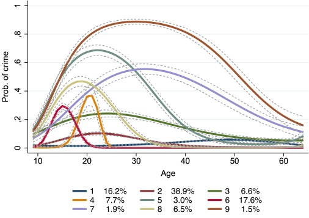
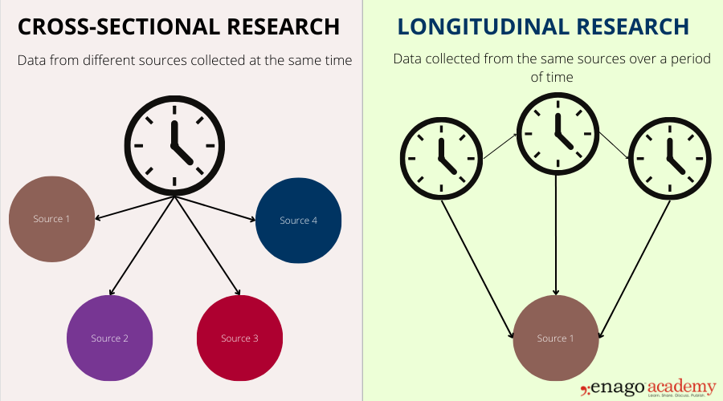
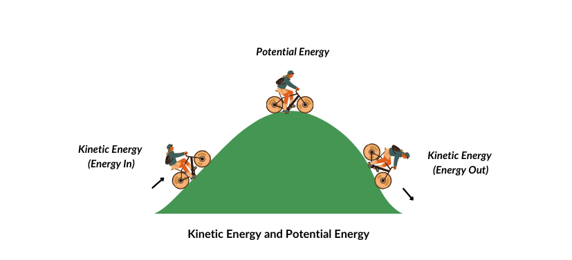
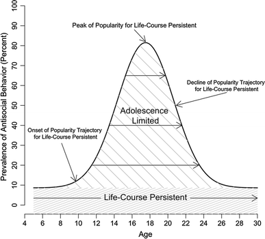

---
format:
  revealjs: 
    theme: styles.scss
    incremental: true 
    slide-number: true
    embed-resources: true
    self-contained: true
    show-notes: false
    preview-links: true
    transition: fade
---


#

::: {.title}


Life-Course Perspectives of Crime 


:::


## Developmental Theories 

Explanatory models that [track individuals throughout their lives, focusing on how and why offending starts, persists, and eventually declines]{.blue}


## Developmental Theories 

::: {.columns}
::: {.column width="50%"}
:::{.smaller-text}

<br>

[Trajectories]{.blue} - A pathway in the line of development that refer to long-term patterns of behavior and are marked by a sequence of life events and transitions 

{.absolute top=300 left=0 height="40%"}
:::

:::
::: {.column width="50%"}
:::{.smaller-text}

<br>

[Transitions]{.blue} - Specific life events within trajectories (e.g., marriage, employment) that can modify the path of the trajectory

{.absolute top=300 right=150 height="30%"}

:::

:::
:::


::: notes

discuss age crime curve in traj

:::

## Developmental Theories 

{fig-align="center"}

::: footer

Image: Enago

:::

## Career Criminal Paradigm 

:::{.small-text}

Alfred Blumstein 

<br>
 
Began studying the “criminal career” rather than just [static snapshots of offending]{.blue}

<br>

[Key Elements:]{style="text-decoration: underline;"}

<br>

[Onset]{.blue} - The age or circumstances under which offending begins

[Frequency]{.blue} (aka Lambda) - [The rate]{.blue} at which an individual offends 

[Duration]{.blue} - How long an individual continues to offend

[Desistance]{.blue} - Stopping or significantly reducing criminal behavior

:::

    
::: notes

Draw a graph 

Rate is a comparison of two quantities that have different units, expressed as a ratio. For example, a speed of 60 miles per hour compares distance (miles) to time (hours). 

:::

## Distinguishing “Criminal Career” vs. “Career Criminal”

[Criminal Career]{.orange} 

The notion that anyone’s [offending can be analyzed in stages]{.orange} — onset, frequency, desistance - whether they offend once or a hundred times

<br>

[Career Criminal]{.blue2} 

A [small group of high-rate offenders]{.blue2} who offend early, frequently, and for a long period, often with minimal desistance
    
## Anti-Developmental Theories

:::{.smallest-text}

[Low Self-Control Theory]{.blue}

Gottfredson & Hirschi (1990):

Argue that self-control is [largely stable by about age 8–10 and remains relatively unchanged throughout adulthood]{.blue}

Low self-control [manifests as impulsivity, risk-taking, and a preference for immediate gratification]{.blue}

According to this perspective, environmental changes (e.g., new job, marriage) [do not radically shift criminal behavior]{.blue}

Instead individuals with low self-control [will continue to engage in deviant acts under most circumstances]{.blue}


:::

{.absolute top=450 left=200 height="30%"}

::: notes

Do not value longitudinal studies, argue against them

Suggests early childhood interventions (particularly parenting and socialization) are crucial because once low self-control is set, it is difficult to alter.

:::

## Sampson and Laub’s Age-Graded Theory

:::{.smallest-text}

[Sampson & Laub (1990)](https://scholar.harvard.edu/files/sampson/files/1990_asr_laub.pdf)

[Model of informal social control that suggests stability and change in antisocial behavior continues throughout life]{.blue}

<br>

Crime is dynamic, not fixed like in low self-control theory - offending can rise and fall over time

Adult social ties matter - work, family, community bonds steer behavior, even after early risks

<br>

[Two levers of change:]{style="text-decoration: underline;"}

[Turning Points]{.blue} – major life events (marriage, military, steady job) that can reset trajectories

[Social Bonds]{.blue} – everyday connections to prosocial institutions

<br>

[Strong bonds or positive turning points can pull individuals off a delinquent path]{.orange}

:::


::: notes

Social bonds to adult institutions of informal social control influence criminal behaviors over the life course despite an individual’s delinquent background   

Changes that strengthen social bonds to society in adulthood will lead to less crime and deviance and changes that weaken social bonds will lead to more crime and deviance 


:::

## Sampson and Laub’s Age-Graded Theory

::: {.smaller-text}

|[Common Turning Point]{.blue}|[How It Re‑routes Behavior️]{.blue2}|
|----|----|
| Military service| Imposes structure, new peer group, sense of duty |
| Stable employment / career | 	Raises “stake in conformity,” daily routine|
| Marriage & parenthood| 	Increases responsibility, prosocial monitoring|
| Geographic mobility| Breaks contact with delinquent peers & settings|

:::

    
# Group Discussion!!!!

## Group Discussion 

```{r}
countdown::countdown(minutes = 10,
                    color_border = "#FF7F50",
                    color_text = "#859ab2",
                    color_running_text = "white",
                    color_running_background = "#859ab2",
                    color_finished_text = "white",
                    color_finished_background = "#FF7F50",
                    top = 0,
                    margin = "0.2em",
                    font_size = "2em")
```

:::{.smaller-text}


<br>

How might evaluating [one freshman cohort over 10 years (longitudinal)]{.blue} uncover trends in social‑media habits, mental‑health swings, student‑debt stress, and shifting friend groups - that [one semester survey (cross-sectional)]{.aqua} could never catch? 


Which [turning points]{.orange} — first serious breakup, landing (or losing) a well‑paid job, graduation into recession vs. boom — [do you predict would bend those trajectories the most?]{.blue2}

<br>

Elect one speaker to discuss

:::

## Laub & Sampson’s “Knifing Off” Theory


:::{.smaller-text}

Major life events [can knife off past criminal routines and launch a prosocial trajectory]{.blue}


[Mechanisms of Change]{style="text-decoration: underline;"}

1️⃣ Structural reset – new schedules & obligations leave little time/opportunity for crime

2️⃣ Relational bonds – spouses, supervisors, or commanders apply informal social control

3️⃣ [Identity shift]{.orange} – people adopt roles (“partner,” “parent,” “worker,” “soldier”) that clash with offending


<br>

Ex: Marriage introduces joint finances and shared responsibilities, narrowing free time and raising the social cost of arrest — reinforcing desistance.

:::

## Local Life Circumstances Model

:::{.small-text}

Horney, Osgood & Marshall 1995 – developed at UNO!!! 

<br>

[Offending is a dynamic response to short‑term changes in a person’s immediate social environment]{.orange}

[Crime fluctuates with these time‑varying “local” circumstances rather than with stable traits or broad societal forces]{.blue}

<br>

Examples of local circumstances: shifts in relationship, employment, housing [quality]{.blue}

<br>

Used ["life-event calendar"]{.blue} to measure change from month to month over three years 

:::


::: notes

Analyzed month-to-month via a "life-event calendar" variations in offending and life circumstances of 658 male convicted felons for a 3-yr period to understand change in behavior


:::

## Thornberry’s Interactional Theory


:::{.smallest-text}

[Dynamic & Longitudinal]{style="text-decoration: underline;"}

Delinquency is both a [cause and a consequence of changing social ties across adolescence and beyond]{.blue}

<br>

Step 1️⃣ Weak Conventional Bonds

When attachment to family, commitment to school, and belief in mainstream values [erode]{.orange}, [a potential for delinquency emerges]{.blue}

<br>

Step 2️⃣  Delinquent Peers Activate Potential

[Joining peer groups]{.orange} that model and reward deviance [converts that potential into actual offending]{.blue}

<br>

Step 3️⃣  Self‑Reinforcing Loop

[Offending further damages conventional bonds and deepens deviant peer ties]{.orange}, [accelerating future delinquency in a feedback cycle]{.blue}

:::

::: notes

Delinquency originates at a weakening of the person’s conventional bond to convention society (i.e., parents, commitment to school, beliefs in conventional values), if weakened, the potential for delinquency increases. 

The potential can only be converted into delinquency, in a social setting in which delinquency is learned and reinforced (delinquent peers, values, behaviors). 

These variables form a mutually reinforcing causal loop that leads to an increase in probability of delinquency over time. 


::: 


 
## Potential to Kinetic Delinquency 


::: {.smaller-text}

It may be easier to understand this with an analogy. 

Step 1 (bottom of the hill), Step 2 (top of the hill), Step 3 (bottom of the hill)

:::




::: notes


Potential and Kinetic Energy 

1 Weak social bonds a potential for delinquency emerges (e.g., bike at bottom of a hill)

2 Joining peer groups creates the climb

3 potential energy at the top of the hill then becomes delinquency  (e.g., bike going down the hill toward delinquency )


:::

## Thornberry’s Potential 


Step 1️⃣ Weak Conventional Bonds Creates Potential 

{fig-align="center"}


## Thornberry’s Potential 

Step 2️⃣  Delinquent Peers Activate Potential

{fig-align="center"}


## Thornberry’s Potential 


Step 3️⃣ Delinquency Occurs and Loop Emerges 


{fig-align="center"}


## Thornberry’s Interactional Theory 

:::{.small-text}

[Summary]{.orange}

<br>

When [social bonds weaken]{.blue}, they create potential for delinquency

<br>

Hanging out with [delinquent peers activates]{.blue} that potential for delinquency

<br>

Resulting behavior that [further erodes those ties, forming a self‑reinforcing loop]{.blue} 


:::

::: notes

Youth from lower‑SES backgrounds often start with weaker bonds and greater exposure to delinquent networks, accelerating the cycle.

::: 


# Group Discussion!!!!

## Group Discussion 

```{r}
countdown::countdown(minutes = 10,
                    color_border = "#FF7F50",
                    color_text = "#859ab2",
                    color_running_text = "white",
                    color_running_background = "#859ab2",
                    color_finished_text = "white",
                    color_finished_background = "#FF7F50",
                    top = 0,
                    margin = "0.2em",
                    font_size = "2em")
```

:::{.smaller-text}

Viral TikTok stunts - like the [Kia Boyz challenges](https://en.wikipedia.org/wiki/Kia_Challenge) - draw millions of “likes” offering instant social approval. 

<br>

Using Thornberry’s interactional theory, discuss how this online reinforcement [can turn a teen’s weakened conventional bonds into real‑world offending]{.blue} and then [propose one intervention (policy change, app feature, or community action)]{.orange} that either:

<br>

1️⃣ Strengthens conventional bonds (e.g., mentor program)

<br>


2️⃣ Disrupts the deviant peer reinforcement loop (e.g., altering the algorithm on platforms)

<br>

Elect one speaker to discuss


:::

## Moffitt's Developmental Taxonomy

::: {.columns}
::: {.column width="50%"}
:::{.small-text}

Terrie E. Moffitt

<br>

Clinical Psychologist and Criminologist at Duke and King's College London

<br>


One of the most [influential](https://scholar.google.com/citations?user=NR0nMHkAAAAJ&hl=en) criminologist in the field

<br>

Awarded the Stockholm Prize in Criminology


:::
:::
::: {.column width="50%"}
{fig-align="center"}
:::

:::


## Moffitt's Developmental Taxonomy


{fig-align="center"}


## Moffitt's Developmental Taxonomy

:::{.smaller-text}

Explains the age-crime curve in terms of antisocial behavior, with two types of offenders

<br> 


[Two Main Pathways of Offending:]{style="text-decoration: underline;"}


<br> 

[Life-Course-Persistent (LCP) Offenders]{.blue}

Early onset of antisocial behavior (e.g., aggression, defiance in childhood)

Continue offending into adulthood

<br> 

[Adolescent-Limited (AL) Offenders]{.blue}

Begin offending during adolescence

Offending is often tied to the “maturity gap,” peer pressure, or desire for adult privileges


:::


    
## The Origin of LCP Offenders

:::{.smaller-text}


<br>

[Heterotypic Continuity]{.aqua}

[A persistent underlying trait manifests in various antisocial behaviors over time]{.blue}

[In other words, for these individuals, early behaviors (e.g., hitting, biting) will continue to evolve into more serious offenses (e.g., robbery, theft)]{.orange}

<br>

[Causes:]{.blue2}

Neurological risks/deficits due to prenatal and neonatal factors (e.g., maternal smoking).

Genetic heritability (e.g., ADHD).

Interaction of difficult temperament ("difficult child") and adverse environments reinforces antisocial behavior patterns.

:::

## Adolescent-Limited (AL) Offenders

:::{.smaller-text}

Offending typically [begins during adolescence]{.blue}

<br>

Driven primarily by the ["maturity gap" — adolescents desire adult privileges but lack access]{.orange}


<br>

Influenced significantly by [peer pressure and social mimicry of antisocial behaviors]{.blue}

<br>

They desist from crime as they enter adulthood, adopting stable social roles and responsibilities

:::

## Biological Maturity Gap

:::{.small-text}

<br>

Puberty arrives (~12-15 yrs), but full [adult privileges — driving, voting, full-time work, autonomy — arrive years later]{.blue}

<br>

Results in a gap where adolescents feel physically mature yet are socially subordinate

<br>

This leads to social mimicry of the LCPs who have access to adult privileges (e.g., smoking, drinking, autonomy)


:::

## Social Mimicry 


::: {.columns}
::: {.column width="50%"}
:::{.smaller-text}


<br>

Adolescents imitate antisocial [behaviors to appear mature and independent]{.blue}

<br>

Behavior copied from peers perceived as having greater autonomy or adult-like privileges

<br>

Ex. Underage drinking and drug use to appear grown-up

:::
:::

::: {.column width="50%"}


:::
:::


::: notes

Biological Analogy: In nature, one species may cue off another to gain a survival edge (e.g., zebras monitor the skittish reactions of gazelles and impalas to detect predators early).

Criminological Parallel: Adolescent‑Limited (AL) youths "borrow" the mature status, power, and perceived privilege of Life‑Course‑Persistent (LCP) peers by imitating their antisocial behaviors.

Desirable Resource: The appearance of adult autonomy and social dominance—things teens crave but have not yet legitimately earned.

:::

## AL and Desistance 

<br>

As AL offenders age, more [legitimate and tangible adult roles emerge]{.blue2}

<br>

As a result, [gradually experience a loss of motivation for delinquency and exit the maturity gap]{.blue}

<br>

As conventional rewards increase, motivation for crime fades and AL offending typically tapers off without formal intervention


## Abstainers 

:::{.smaller-text}

[Individuals who show no recorded delinquency across adolescence]{.blue2}

<br>

[Key explanations:]{style="text-decoration: underline;"}

<br>

[Late Puberty]{.blue} – Less pressure to mimic older, “cool” peers

[Alternative Status Sources]{.blue} – Respectable roles (e.g., athletics, academics, part‑time work) already confer adult‑like recognition

[Protective Environments]{.blue} – High parental monitoring or prosocial schools limit exposure to delinquent models

[Exclusion from Deviant Networks]{.blue} – Traits such as shyness or risk‑aversion keep them outside antisocial peer groups

::: 

## Contrast LCP and AL

:::{.smaller-text}

<br>

|Features |[LCP]{.blue}| [AL]{.blue2}
|----|----|----|
| Onset of Offending | Early Childhood | Adolescence  |
| Duration of Offending | Persistent through adulthood | Short-term, adolescent years  |
| Frequency of Offending | High and consistent | Episodic and situational  |
| Causes | Neuropsychological + environment | Social mimicry, peer influence, maturity gap  |


:::


# Group Discussion!!!!

## Group Discussion 

```{r}
countdown::countdown(minutes = 10,
                    color_border = "#FF7F50",
                    color_text = "#859ab2",
                    color_running_text = "white",
                    color_running_background = "#859ab2",
                    color_finished_text = "white",
                    color_finished_background = "#FF7F50",
                    top = 0,
                    margin = "0.2em",
                    font_size = "2em")
```

:::{.smaller-text}


Considering modern issues such as social media influence, online peer pressure, and changing social dynamics, [discuss how these factors might shape adolescent-limited offending today.]{.blue} Remember AL offending is only present in the age-crime curve spike and disappears in the early to mid twenties. 

<br>

Next identify [one specific intervention that would be effective for preventing a life-course-persistent offender trajectory.]{.orange}

<br>

Elect one speaker to discuss

:::


## Policy Implications

:::{.small-text}


[LCP Offenders:]{.blue}

<br>

Early intervention (e.g., parenting programs, social skills training)

<br>


Specialized therapeutic and educational support for neurological and behavioral issues

<br>

[AL Offenders:]{.blue2}

<br>


Structured community programs promoting positive peer relationships

<br>


Policies targeting adolescent needs for independence and meaningful societal roles

:::


## Have a goooooooood weekend!

{fig-align="center"}


::: footer

Image: Giphy

:::