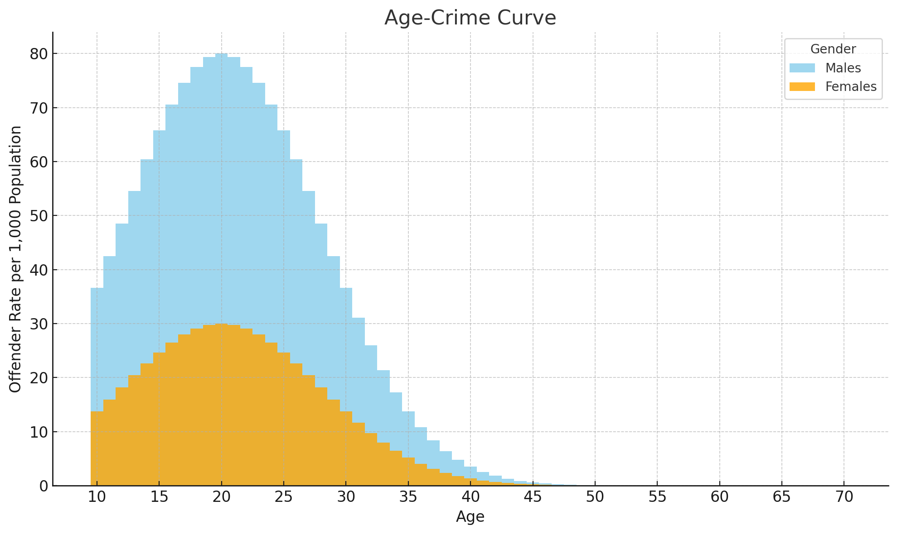

---
format:
  revealjs: 
    theme: styles.scss
    incremental: true 
    slide-number: true
    embed-resources: true
    self-contained: true
    show-notes: false
    preview-links: true
    transition: fade
---

#

::: {.title}

Toxic Masculinity and Crime

:::

## Sex Differences in Crime  

{fig-align="center"}

## Schemas and Scripts 

:::{.smaller-text}

 

[Schema]{style="text-decoration: underline;"}

[A mental framework that organizes what we know about a concept, person, group, or situation and guides how we notice, interpret, and remember new information]{.blue2}

 

Masculinity Schema ➡️ Sets the standards & traits that men are expected to embody (e.g. a 'real man')

 

[Scripts]{style="text-decoration: underline;"}

[Culturally learned  'mental playbooks' or instructions that tell us how to behave, feel, and respond in specific situations]{.orange}

 

Masculinity Scripts ➡️ Orchestrates behavior in real time to meet the schema’s standard (e.g. how to prove or show the 'real man' schema)

:::

## Schemas and Scripts 

:::{.small-text}

Toxic masculinity isn’t innate — it’s a learned schema that fuels scripts

 

| Stage | Example |
|----|----|
| [Schema]{.blue2} | Locker-room talk primes 'real-man' traits
| [Script]{.orange} | Boasting, mocking weakness, celebrating conquest
| Reinforcement | Peers reward conformity (laughter, status); punish deviation (ridicule)

:::

## Toxic Masculinity

::: {.smaller-text}

[A cultural schema and script that equates 'real manhood' with dominance, aggression, and emotional suppression]{.orange}

 

[Core Ideas:]{style="text-decoration: underline;"}

Power and control over others

[Rejection of vulnerability]{.blue} and care-giving traits

[Validation through risk-taking or violence]{.blue}

 

[Why it matters in criminology:]{style="text-decoration: underline;"}

[Normalizes aggressive behavior]{.blue2}

Shapes peer pressure, [gang culture]{.blue2}, and certain policing subcultures

Contributes to [under-reporting of male victimization and mental-health struggles]{.blue2}

::: 

## TM: What It Is vs Is Not

::: {.smaller-text}

 

| Is | [Is Not]{.orange} |
|----|----|
| Harmful norms tying “manhood” to dominance, aggression, and emotional shutdown | [A claim that masculinity itself is bad]{.aqua} |
| Learned scripts pushing men to prove worth through control, risk, or violence | [An attack on positive male traits like courage and responsibility]{.blue2}|
| A factor that fuels violence, mental-health stigma, and under-reporting of male victimization | [A political buzzword]{.violet} |

:::

## Toxic Masculinity

::: {.smaller-text}

|Core Norm|How It’s Taught|[Deviant Precursors and Problematic Behaviors]{.orchid} |
|----|----|----|
| Emotional detachment|	“Real men don’t cry.”| [Bottled-up anger leads to outward violence]{.orange} |
| Aggression & dominance | “Win at any cost.” | [Normalizes bullying, partner abuse, gang violence]{.orange}|
| Disdain for vulnerability| “Weakness is feminine.” | [Stigmatizes seeking help, therapy, or intervention]{.blue2} |

[Orange]{.orange} = affects antisocial behavior directly

[Blue]{.blue2} = affects more the actors of the justice system (e.g., police officers)

:::

## Scripts to Crime

::: {.small-text}

 

[Proving manhood]{.orange} through force

Assaults, bar fights, intimate-partner violence

 

[Controlling sexuality]{.orange}

Sexual assault, revenge porn, trafficking

 

[Status-seeking subcultures]{.orange}

Street gangs, extremist 'incel' forums, hate crimes

 

[Masking insecurity]{.orange}

Firearms possession, road-rage

:::

## Extremist “Incel” Forums

:::{.smaller-text}

[Misogynistic online spaces where self-declared “involuntary celibates” blame women for their sexual/romantic frustration, view women as de-humanized objects, and glorify violence against them]{.blue}

 

General Mechanism: 

Isolation  ➡️ [Internalizing misogynist scripts]{.orange}  ➡️ Echo-chamber reinforcement ➡️ Violence

 

Violence occurs when: 

Male-supremacist extremism weaponizes toxic-masculinity norms (dominance, aggression, emotional detachment) into lone-actor violence, hate crimes, and online radicalization pipelines

 

Read more [here](https://www.theguardian.com/uk-news/2021/aug/13/plymouth-shootings-may-be-a-sign-the-incel-culture-is-spreading) from the Guardian

[The Angry Echo Chamber: A Study of Extremist and Emotional Language Changes in Incel Communities Over Time](https://journals.sagepub.com/doi/10.1177/08862605241239451)

:::

##  Mass Shootings: Pulse Nightclub 

:::{.small-text}

[Toxic-masculinity scripts]{.orange} and radicalized extremism 

 

The perpetrator had a history of homophobic remarks within Incel Forums, had issues with masculinity, sexuality, and violent self-image

 

Resulted in a targeted attack on a marginalized community - 49 killed, 53 injured during LGBTQ+ club

 

Read more [here](https://www.independent.co.uk/voices/toxic-masculinity-was-just-as-much-to-blame-for-the-orlando-shootings-as-radical-islam-a7083071.html)

::: 

## Impact on the Justice System

::: {.smaller-text}

|System|Toxic-Masculinity Lens | Example Consequences
|----|----|----|
| Policing | [Warrior Culture]{.orange} | Overuse/Over-reliance on use of force
| Courts | Punishment can be framed as a test of manhood/toughness | Harsher sentences for crimes that “challenge manhood”
| Corrections | Vulnerability | in-prison stigma around therapy and mental-health meds
| Re-entry | 	Pressure to “reclaim” masculine status | Resistance to counseling; recidivism risk

:::

## Policing & “Warrior Culture” 

:::{.smaller-text}

[Police socialized to view every encounter as a potential deadly fight—citizens become adversaries]{.blue}

Institutional frame that prioritizes officer safety above all else, reinforced through training videos, memorials of fallen officers, and “command presence.”

 

[Toxic-masculinity overlap]{style="text-decoration: underline;"}

[Valorizes dominance, aggression, emotional detachment as proof of competence]{.orange}

[Stigmatizes de-escalation or admitting fear, fueling over-reliance on force]{.orange}

 

[Criminological consequences]{style="text-decoration: underline;"}

[Excessive use-of-force incidents]{.forest}

[Loss in community trust (e.g., George Floyd)]{.forest}

Read more: Michael Sierra-Arévalo, [The Danger Imperative: Violence, Death, and the Soul of Policing](https://cup.columbia.edu/book/the-danger-imperative/9780231198479/)

:::

## Ways to Help Counter Toxic Masculinity

:::{.smaller-text}

 

[Teach early:]{.blue} build emotional-literacy & bystander lessons into K-12 health classes

 

[Show alternatives:]{.blue} spotlight athletes, influencers, & pod-casters that speak about toxic masculinity

 

[Normalize help-seeking:]{.blue} treat sharing feelings and therapy as everyday strength, not weakness

 

[Disrupt online hate:]{.blue} down-rank misogynist posts (e.g., reddit) and promote counter-narratives

:::

## Final Exam

:::{.small-text}

Questions? 

 

[Same room on May 13th at 10 am]{.blue}

::: 

{fig-align="center"}

## All Good Things End

[Thanks for your attention and participation this year]{.blue2}

[Good luck on your academic journey]{.blue}

 

{fig-align="center"}

