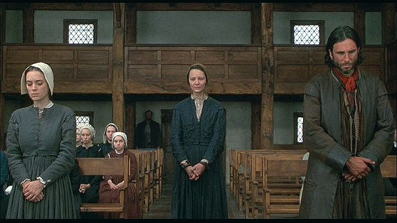
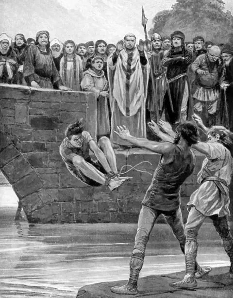
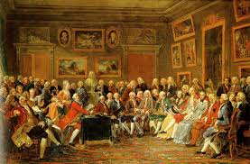
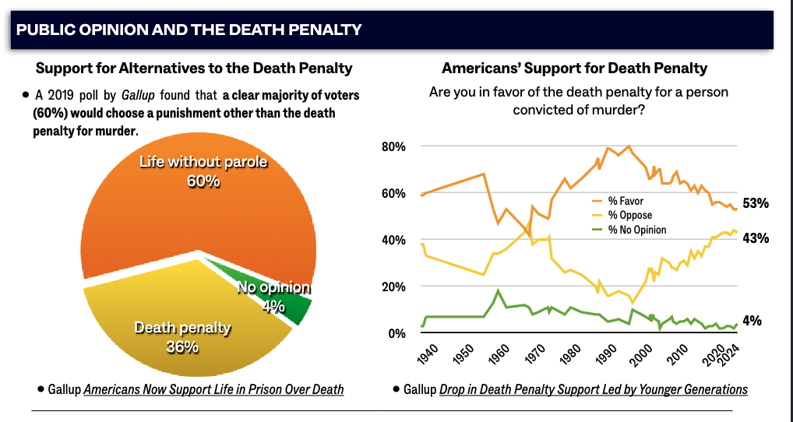

---
format:
  revealjs: 
    theme: styles.scss
    incremental: true 
    slide-number: true
    embed-resources: true
    self-contained: true
    show-notes: false
    preview-links: true
    transition: fade
---

```{r}

library(countdown)

```
#

::: {.title}

Preclassical and Classical Theories 

:::


::: notes

Mention that this class will discuss topics that may counter other people's beliefs or political opinions. 

With that said, in times like these, it's imperative that we can all have a civil discourse and discuss thing with reason and not take offense to other people's opinions. 

:::

## Preclassical Theories 


Before the Age of Enlightenment, many civilizations attributed crime to [religious or supernatural causes]{.blue} (e.g., think 'Salem witch trials' in 1692). 

::: {.small-text}
A great cinematic reference of this time point is Arthur Miller's [The Crucible](https://www.imdb.com/title/tt0115988/)
:::

{fig-align="center"}


::: footer

image: wordpress

:::


## Spiritulaism

Spiritualism stressed the conflict between [absolute good and absolute evil]{.blue}. 

People who committed crimes were thought to be possessed by evil spirits, often
referred to as sinful demons.

Primitive people explained [natural disasters such as floods and famines as punishments by spirits for
wrongdoings.]{.blue}

* Any parallels with our current time? 


## Spiritulaism

During these times, methods were constructed for dealing with those accused of committing crimes. 

<br>

Two common methods were [Trial by Battle]{.blue} and [Trial by ordeal]{.blue}. 

<br>

The main idea was that God would intervene in favor of the innocent. 

## Trial by Battle

[Permitted the victim or some member of his or her family to fight the offender or some member of the offender’s family.]{.blue}

It was believed that victory would go to the innocent if he or she believed in and trusted God.


{fig-align="center"}

::: footer

image: giphy 

:::


## Trial by Ordeal 

:::: {.columns}
::: {.column width="50%"}

::: {.small-text}

[Determined guilt or innocence by subjecting the accused to life threatening and/or painful situations.]{.blue}

<br>

For example, people might have tied up and thrown into a body of water

<br>

It was believed that if they were innocent, then God would keep them from drowning if they were guilty, then a painful death would occur.

:::

:::

::: {.column width="50%"}

{.absolute top=80}

:::


:::

::: footer

image: BBC

::: 


## The Age of Enlightenment


:::: {.columns}
::: {.column width="50%"}


An intellectual movement (late 17th to 18th century) that [emphasized reason, individualism, and scientific thought over tradition and religious dogma.]{.blue}

<br>

Leading figures of this movement: 

Cesare Beccaria, Thomas Hobbs, Jeremy Bentham, John Locke


:::

::: {.column width="50%"}

**Major Tenets:**

<br>

[Rationality and Free Will]{.blue}

<br>

[Social Contract and Deterrence]{.blue}

<br>

[Legal Reform]{.blue}

:::

:::


::: notes

Enlightenment thinkers believed that human beings were capable of rational thought and that society could be improved through reason, reform, and the application of scientific principles.

:::

## The Age of Enlightenment

[Thomas Hobbs and the Social Contract]{.orange}: In his seminal work *Leviathan*, Hobbes [argued that humans enter into a social contract to avoid a state of constant conflict and chaos.]{.blue}


{fig-align="center"}

## The Age of Enlightenment

[Rationality and Free Will:]{.blue}

Cesare Beccaria and Jeremy Bentham, argued that humans are rational beings who make decisions by weighing the costs and benefits of their actions. 

<br>

This is often termed as ["Hedonistic Calculus"]{.blue}, coined by Bentham. 

A method for [calculating the amount of pleasure and pain that an action is likely to cause]{.blue}, which considers the intensity, duration, certainty, and other factors of an action's pleasure and pain. 


## The Age of Enlightenment

The Social Contract Explained:

<br>

[Citizens’ Agreement:]{.blue} Individuals consent to abide by established rules and laws.

<br>

[Government’s Role:]{.blue} In return, a central authority is granted the power to enforce laws, provide protection, and maintain social order.

<br>

[Purpose:]{.blue} This mutual agreement ensures stability, security, and a more orderly society.

::: notes

We recently (within the past 5 years) went through a test of this. Can anyone think of what I'm referring to? 

:::


## The Age of Enlightenment

Legal Reform


::: {.small-text}

<br>

Key Principles:

[Crime and Society:]{.blue} The harm a crime causes society is its true measure.

[Proportional Punishment:]{.blue} Offenses should receive fair and proportionate punishments.

[Right to Confrontation:]{.blue} Defendants must be allowed to face and cross-examine their accusers.

[Opposition to Torture:]{.blue} Torture should not be used to extract confessions

[Preventative Education:]{.blue} Improving education is essential for crime prevention

:::

## The Classical School 
### Deterrence

<br>

Punishment should be designed to [deter criminal behavior]{.blue} rather than to exact revenge.

<br>

This means that penalties must be [clear, proportionate to the offense, and consistently applied to serve as an effective warning to potential offenders.]{.blue}


## The Classical School 

<br>

What the difference between first-degree and second-degree murder? 

<br>

* *Malice aforethought*


## The Classical School 
### Intent 

<br>

[Actus Reus ("Guilty Act"):]{.blue}

The physical act or unlawful conduct that constitutes the offense

[Mens Rea ("Guilty Mind"):]{.blue}

The mental state or intent to commit a crime at the time of the act

* Which on is considered second degree? 


# Group Discussion!!! 

##  Group Discussion!!! 


```{r}
countdown::countdown(minutes = 5,
                    color_border = "#FF7F50",
                    color_text = "#859ab2",
                    color_running_text = "white",
                    color_running_background = "#859ab2",
                    color_finished_text = "white",
                    color_finished_background = "#FF7F50",
                    top = 0,
                    margin = "0.2em",
                    font_size = "2em")
```


<br>

<br>

With your group, [discuss the value, or lack there of, for the dealth penality in the United States?]{.blue}

<br>

For simplicity in your argument, consider the crime of capital murder.

<br>

Elect one speaker to present your point.


## The Death Penality 


::: {.small-text}

[Ancient Roots:]{.blue}

First death penalty laws date to the 18th Century BCE in the Code of Hammurabi (~3,724–3,823 years ago)

<br>

[Colonial America:]{.blue}

Brought by European settlers; first recorded execution was Captain George Kendall in Jamestown, Virginia (1608) for spying

<br>

[Modern Era:]{.blue}

1972: *Furman v. Georgia* suspended the death penalty, ruling it violated the 8th Amendment ("cruel and unusual punishment")

1976: States revised laws; death penalty reinstated after *Gregg v. Georgia*, ruling it did not violate the 8th Amendment

:::

::: notes

Nearly 4,000 years old and we still are uncertain of use

::: 

## The Death Penality (For)

::: {.small-text}

[Deterrence of Crime]{.blue}

* The threat of execution may discourage individuals from committing heinous acts

[Retribution and Justice]{.blue}

* Provide closure to victims' families and ensure that offenders face proportional consequences

* The principle of "an eye for an eye" is often cited as a moral justification

[Public Safety]{.blue}

* Ensures they cannot commit further crimes, protecting society from repeat offenders

:::

## The Death Penality (Against)

::: {.small-text}

[Risk of Wrongful Execution]{.blue}

* Mistakes in the legal process, such as inadequate legal representation or racial bias, can lead to irreversible errors

* Since 1973, at least **200 people** who were wrongly convicted and sentenced to death in the U.S. have been exonerated

[Deterrence of Crime]{.blue}

* Evidence from across the world, has shown the death penaly has [no unique deterent effect on crime.](https://www.amnesty.org/en/wp-content/uploads/2021/06/act500062008en.pdf)

[Racial and Socioeconomic Bias]{.blue}

* The death penalty is disproportionately applied to marginalized groups, including racial minorities and individuals from low-income backgrounds

:::


## Beccaria and the Death Penality

Beccaria was against the death penalty: 

<br>

[Violates the Social Contract:]{.blue} It disrupts the mutual agreement between citizens and the state

[Ineffective Deterrent:]{.blue} It doesn't prevent crime more effectively than lesser punishments

[Irreversible:]{.blue} Once carried out, any judicial error cannot be corrected

[No Rehabilitation:]{.blue} It removes the chance for reform and reintegration into society


::: notes


**Violates SC** - Individuals give up some freedoms in exchange for security and order, however he believed the right to life is inalienable and cannot be forfeited, in any circumstance. 

**Ineffective Deterrent** - He believed that the *certainty and swiftness* of punishment are far more effective in preventing crime than its severity.

**Irreversible** -  Argued that the execution of an innocent person is an unforgivable injustice, and no legal system is immune to mistakes

**No Rehabilitation** - The whole point of the justice system, to a degree, is to rehabilitate.


:::

## Public Opinion 

{fig-align="center"}

::: footer

image: [Death Penalty Information Center](https://dpic-cdn.org/production/documents/pdf/FactSheet.pdf?dm=1738593648)

:::


## The Three Key Elements of Deterrerence 


::: {.small-text}

[Swiftness of Punishment:]{.blue}

The punishment should follow the crime [quickly]{.orange} to clearly link the offense with its consequences, reducing any disconnect between the behavior and the penalty

<br>

[Certainty of Punishment:]{.blue}

There should be a [high likelihood that offenders will be caught and punished]{.orange}, reinforcing the risk associated with criminal actions

<br>

[Severity of Punishment:]{.blue}

The punishment must be [harsh/proportional enough]{.orange} to outweigh any perceived benefits of committing the crime

::: 

## The Two Types of Deterrence 


::: {.small-text}

[General Deterrence]{.blue}

Discourages the [*public at large from committing crimes*]{.orange} by making an example of punished offenders


Sends message that criminal behavior will result in significant consequences to [members of society not involved in act]{.orange}

<br>

[Specific Deterrence]{.blue}

[*Targets individuals who have already committed crimes*]{.orange}, aiming to prevent them from reoffending

Focuses on [modifying the behavior of the offender]{.orange} through the experience of punishment

::: 

# Group Discussion!!! 

##  Group Discussion!!! 


```{r}
countdown::countdown(minutes = 5,
                    color_border = "#FF7F50",
                    color_text = "#859ab2",
                    color_running_text = "white",
                    color_running_background = "#859ab2",
                    color_finished_text = "white",
                    color_finished_background = "#FF7F50",
                    top = 0,
                    margin = "0.2em",
                    font_size = "2em")
```


<br>


Bentham emphasized that the [certainty of punishment is more important than its severity.]{.blue}

Should governments focus more on [increasing the likelihood of being caught (e.g., more policing, fewer privacy laws) or increasing punishment severity (e.g., longer sentences, stricter regulations on individuals post conviction)?]{.orange}

With your policy in mind, come up with a positive and a negative consequence of its implementation. 

<br>

Elect one speaker to present your point.


## The Neoclassical School 

[Beccaria’s Framework Limitations:]{.blue}

Focused only on the act (actus reus) and dismissed intent (mens rea)

* [Problem:]{.red} A repeat offender could receive the same punishment as a first-time offender

[Evolution to Neoclassical Thought:]{.blue}

Recognizes the importance of context and individual circumstances

[Allows punishment to be tailored—either increased or reduced—based on the specifics of the offense and the offender]{.orange}


## Policy Implications 

The death penalty is intended to deter crime, but there is [no evidence that it actually does so.]{.blue}

<br>

Increasing the number of police in an area to deter crime often leads to [over-policing in vulnerable communities.]{.blue}

<br>

Overreliance on incarceration disproportionately affects minority and low-income communities and contributes to [Mass Incarceration.]{.blue}

## Have a great day!


::: footer

image: giphy

:::

