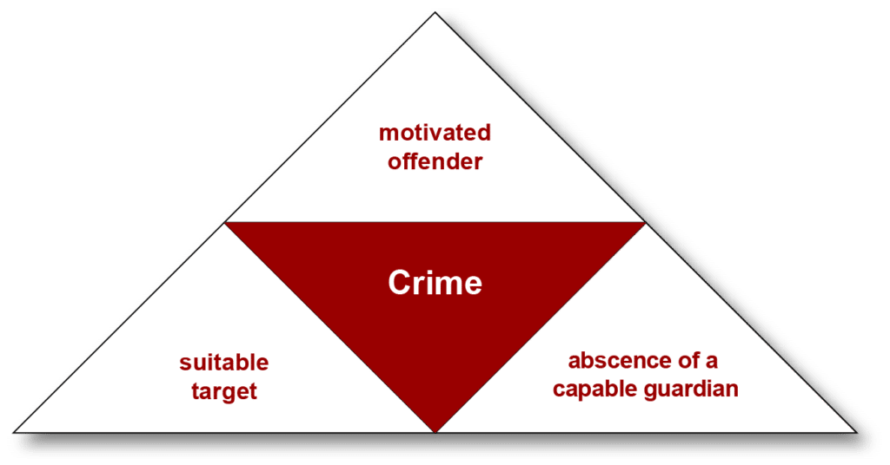

---
format:
  revealjs: 
    theme: styles.scss
    incremental: true 
    slide-number: true
    embed-resources: true
    self-contained: true
    show-notes: false
    preview-links: true
    transition: fade
---

# 

::: {.title}

Modern Applications of the Classical Perspective

:::

## Modern Model of Deterrence


:::: {.columns}

::: {.column width="50%"}

<br>

The modern model of deterrence expands beyond traditional approaches, incorporating both [formal and informal factors]{.blue} and [decision making]{.orange} to better understand and prevent criminal behavior.

:::

::: {.column width="50%"}

<br>

 
:::

:::

::: footer

image: Medium

:::


## Factors in Decision-Making 

Crime decision-making is shaped by a combination of [formal]{.blue} and [informal]{.blue} factors, with insights heavily influenced by [vignette research]{.orange}.

<br>

**Vignettes** are scenario based thought experiments that are used to evaluate hypothetical dilemma or ethical issues in decision making.

<br>

[The Trolly Problem](https://neal.fun/absurd-trolley-problems/) (Click)

::: notes

Purpose:  

**Utilitarianism**   

Take an action that minimizes overall harm (e.g., pulling the lever to save five people at the cost of one life).  

In the Trolley Problem, pulling the lever to save five lives at the cost of one is justified because it results in the least overall harm.  

**Deontological (De-on-toe-logical) Ethics (Immanuel Kant)**  

Refuse to take an action that involves actively harming someone, even if it leads to a greater good (e.g., not pulling the lever because killing is inherently wrong).  

Actively causing harm (e.g., pulling the lever to kill one person) is morally impermissible, even if it saves more lives.   

-

Try to emphasize the informal factors here. Peer-influence in a classroom would be easiest. Use board and a vote system. 

:::


## Formal Factors  

Formal factors are [institutionalized mechanisms—official, legal, or state-enforced—that shape an individual’s decision to commit a crime.]{.blue}

<br>

::: {.small-text}

[Legal Penalties]{.orange}

Severity of punishment (e.g., prison sentences, fines) increases the perceived cost of crime.

Rational Choice Theory (RCT) suggests harsher penalties act as a deterrent.

[Probability of Apprehension]{.orange}

Likelihood of being caught (e.g., police presence, surveillance) influences perceived risk.

Higher enforcement visibility reduces the appeal of criminal behavior.
        
:::

## Informal Factors

Informal factors are [non-institutionalized influences—rooted in social relationships, cultural norms, and personal circumstances—that shape an individual’s decision to commit a crime.]{.blue}

<br>

::: {.smaller-text}

[Social Bonds and Relationships]{.orange}

Strong ties to family, friends, religious beliefs, or community deter crime.

Fear of losing respect or damaging relationships discourages criminal behavior.

[Peer Influence]{.orange}

Association with delinquent peers or criminal networks normalizes crime and increases opportunities for offending.

[Stigma and Shame]{.orange}

Fear of social disapproval or being labeled a "criminal" can outweigh the benefits of crime.

:::

## Rational Choice Theory 

[Cornish and Clarke]{.grey} brought this theory into mainstream criminology, adapting it from economic principles.

::: {.small-text}

Core Principles:

[Rational Decision-Making]{.blue}

Individuals engage in criminal behavior after weighing potential benefits (rewards) against costs (risks).

Individuals assess the likelihood of being caught and the severity of punishment before acting.

[Influence of Formal and Informal Factors]{.blue}

Both formal (e.g., legal penalties) and informal (e.g., social bonds) factors shape decisions, with [informal factors often playing a more significant role.]{.orange}

:::

# Group Discussion!!! 

##  Group Discussion!!! 


```{r}
countdown::countdown(minutes = 10,
                    color_border = "#FF7F50",
                    color_text = "#859ab2",
                    color_running_text = "white",
                    color_running_background = "#859ab2",
                    color_finished_text = "white",
                    color_finished_background = "#FF7F50",
                    top = 0,
                    margin = "0.2em",
                    font_size = "2em")
```


The Trolley Problem pits [utilitarianism (minimizing overall harm)]{.blue} against [deontological ethics (refusing to actively harm someone, even to save others).]{.blue2}

<br>

[With this dilemma in mind, should police officers use force to neutralize a threat to protect many?]{.orange}

Consider both extreme cases (like mass shootings) and common scenarios (such as mental health crises). 

<br>

As with pulling the lever in the trolley scenario, [choose one approach—either utilitarianism or deontological—and elect one speaker to present your argument.]{.grey}

## Recap

## Routine Activities Theory (RAT)

{fig-align="center"}

## Routine Activities Theory (RAT)

Cohen and Felson (1979), [Everyday patterns of activity create opportunities for crime.]{.blue}


:::{.small-text}

[Motivated Offender:]{.orange}

Someone who is willing (and able) to commit a crime.

[Suitable Target:]{.orange}

A person or property that the offender perceives as vulnerable, valuable, or otherwise attractive.

[Lack of Capable Guardianship:]{.orange}
        
The absence or weakness of people, security measures, or other deterrents that could prevent the crime.

:::


[All three elements converge in time and space]{.blue} during the course of individuals’ routine daily activities.


## Motivated Offender 

Motivated offenders are individuals who possess both the [capacity and the willingness]{.blue} to commit crimes.

<br>


Motivation is [intrinsic and remains consistent regardless of changes in the environment.]{.orange}

<br>

The likelihood of a crime occurring depends on factors that [affect the offender’s ability to act, not their level of motivation.]{.orange}


## Suitable Target

A suitable target [is a person, property, or object that a motivated offender can easily identify and engage with.]{.blue}

<br>

::: {.small-text}

[Accessibility:]{.orange} The target must be within reach of the offender.

[Value:]{.orange} Targets may include valuable items (e.g., expensive jewelry, homes) or individuals associated with such items.

[Vulnerability:]{.orange} The target’s level of protection or exposure influences its suitability.

<br>

*Examples:*

Nonhuman Targets: Expensive houses, luxury cars, or valuable jewelry (e.g., burglary, theft).

Human Targets: Individuals wearing or occupying valuable objects (e.g., robbery, assault).

:::

## Lack of Capable Guardianship

Capable guardians are [individuals, objects, or systems]{.blue} that deter criminal activity through their presence or actions.

<br>

Types of Guardianship:


[Formal Guardianship:]{.orange} Police officers, security personnel, or surveillance systems.

[Informal Guardianship:]{.orange} Ordinary citizens, neighbors, locks, walls, or community watch groups.


## Lack of Capable Guardianship

[How it works:]{.blue}

The presence of guardians (e.g., a police officer or security camera) can [discourage motivated offenders from acting.]{.blue}


[Even when a suitable target exists, effective guardianship can prevent crime by increasing the perceived risk for the offender.]{.orange}


::: {.small-text}

Examples:

A police officer patrolling a neighborhood reduces the likelihood of assault or theft.

Community watch programs or vigilant neighbors can enhance safety and deter criminal activity.

:::

## Hot Spots and RAT

[Lawerence Sherman et al., (1989)](https://onlinelibrary.wiley.com/doi/abs/10.1111/j.1745-9125.1989.tb00862.x)


Geographic areas with a high concentration of criminal activity, linked to the convergence of RAT’s three elements.


:::{.small-text}

**Why They Form:**

[Environmental Factors:]{.orange} Local SES that inadvertently create favorable conditions for crime.

[Routine Activities:]{.orange} High foot traffic areas (e.g., malls, transit hubs).

[Target Density:]{.orange} Concentrated high-value or vulnerable targets.

[Concentration of Opportunities:]{.orange} Areas where motivated offenders encounter vulnerable targets with few capable guardians.


*Examples of place:* intersections, poorly lit streets, areas with high amount of bars, busy transit hubs during peak hours.

:::

::: notes

How to make hot spots safer, with the idea of capable guardian in mind?    

Increase guardianship (e.g., police patrols, CCTV) in high-risk areas.   

Reduce target suitability through environmental design (e.g., better lighting, access control).  


:::

## Hot Spots in Omaha 

<br>

[Crime Mapping](https://police.cityofomaha.org/crime-information/crime-mapping)

<br>

Then click "opdcrimemapping.com"

<br>


# Group Discussion!!! 

##  Group Discussion!!! 


```{r}
countdown::countdown(minutes = 10,
                    color_border = "#FF7F50",
                    color_text = "#859ab2",
                    color_running_text = "white",
                    color_running_background = "#859ab2",
                    color_finished_text = "white",
                    color_finished_background = "#FF7F50",
                    top = 0,
                    margin = "0.2em",
                    font_size = "2em")
```


With the rapid advancement of technology in the past five years (e.g., artificial intelligence, social media, drones), [can technology fully replace human guardians, or are there limitations?]{.orange} Make an argument for or against.

<br> 

Keep in mind the [socioeconomic factors]{.blue} (e.g., cost to society) and [social inequity]{.blue} (e.g., biased surveillance of minority populations) factors that can arise.

<br> 

Elect one speaker to present your argument.


## Policy implications 


<br>

[Broken Windows Policing]{.blue }

Crack down on minor offenses to reduce major crimes.

<br>

[Three Strikes]{.blue }

Assumes that offender will make a rational choice not to commit future offenses because they could go to prison for life if they reach [three]{.blue} felonies.


## Have a good weekend!!! 


::: footer

image: giphy 

:::
