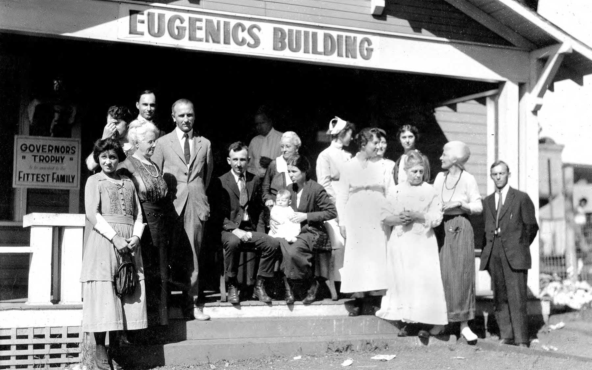
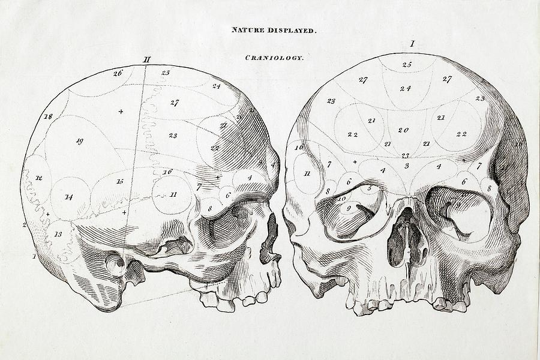
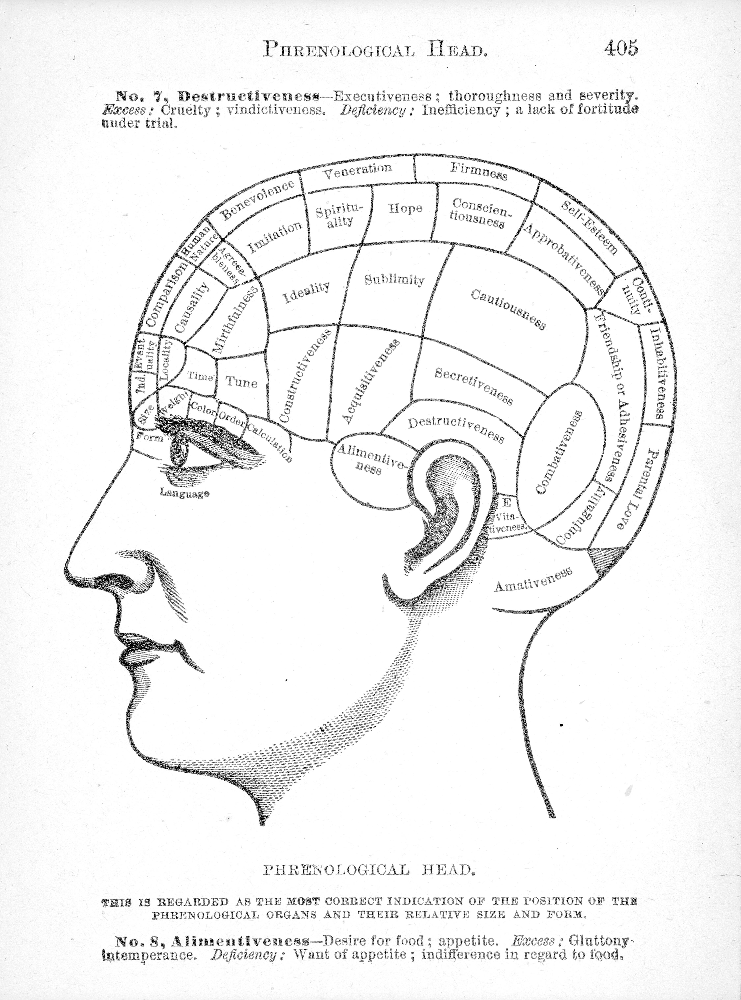
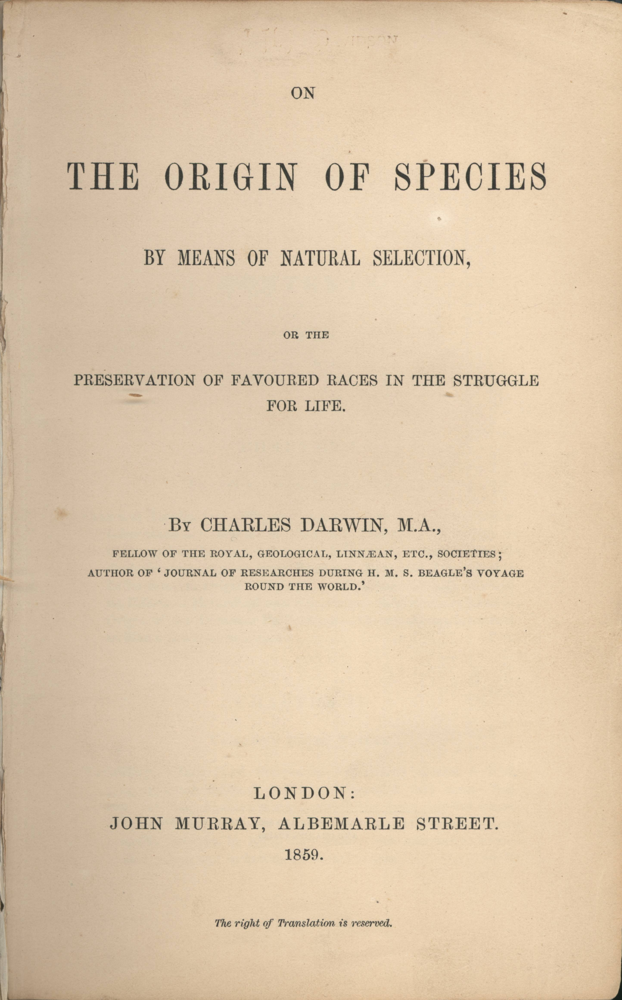
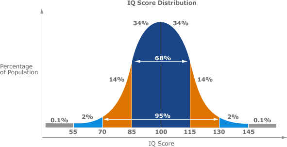
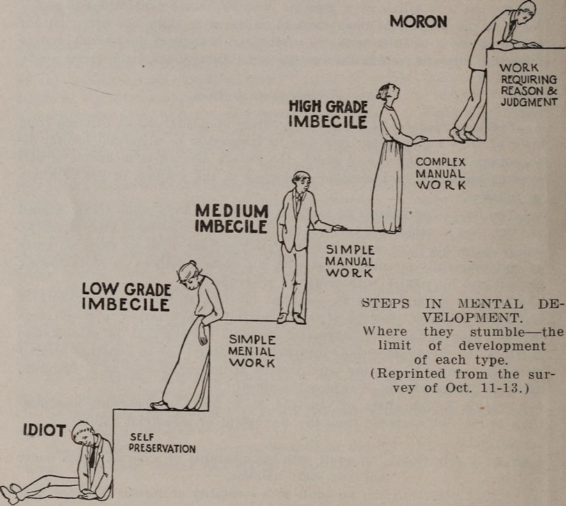

---
format:
  revealjs: 
    theme: styles.scss
    incremental: true 
    slide-number: true
    embed-resources: true
    self-contained: true
    show-notes: false
    preview-links: true
    transition: fade
---

# 

::: {.title}

Early Positive School Perspectives of Criminality

:::

## Pseudoscience

[A collection of beliefs or practices mistakenly regarded as being based on scientific method or evidence.]{.blue}

<br>

[Characteristics:]{.blue2}

<br>

1.) Lacks empirical support or testability.

2.) Relies on anecdotal evidence or subjective validation.

3.) Often resistant to criticism or revision.

<br>

*Example:* Astrology - the belief that celestial bodies influence human behavior and personality traits.

##


::: footer

image: giphy

:::

# EVERYTHING YOU ARE ABOUT TO HEAR IS A PSEUDOSCIENCE!

## Eugenics 

:::{.small-text}

The study and implementation of [policies aimed at improving the human race through controlled reproduction, often enforced on specific groups.]{.orange}

Individuals were classified into "superior" and "inferior" groups based on perceived genetic traits.

Linked criminal behavior to heredity and [advocating for selective reproduction to reduce crime.]{.blue}

:::


{fig-align="center"}


::: footer

image: Cold Spring Harbor

:::

## Craniometry


:::{.small-text}

The study of [skull and brain size as indicators of superiority or inferiority among individuals or racial/ethnic groups.]{.blue}

Skull size and shape were believed to reflect brain capacity, [with larger skulls indicating higher intelligence and moral superiority.]{.orange}

Used to justify racial hierarchies and discriminatory policies that [linked traits to criminal behavior.]{.blue2}

:::


{fig-align="center"}

::: footer

Image: Science Photo Gallery

:::


::: notes

It was believed that the skull's size and shape perfectly reflected the brain's structure and capacity, with larger skulls indicating greater intelligence and moral superiority.

:::

## Physiognomy 


::: {.columns}
::: {.column width="50%"}

:::{.small-text}

Claimed to assess personality traits by analyzing [skull shape and bumps.]{.blue}

Believed skull contours matched brain structure, linking specific areas to mental faculties or behaviors.

Influenced criminology by [tying criminal tendencies to physical traits, stigmatizing certain groups.]{.orange}

:::

:::

::: {.column width="50%"}

{.absolute top=50 right=10 height="70%"}

:::
:::


::: footer

Image: Carnegie Mellon University

:::

#

{fig-align="center"}

::: footer

Image: giphy

:::

# THIS NEXT SLIDE IS [NOT]{.blue} PSEUDOSCIENCE!

## On the Origin of Species (1859)


::: {.columns}
::: {.column width="60%"}

::: {.small-text}

**Charles Darwin**

[Foundation of modern biology and genetics.]{.orange}

Explains species change via [natural selection]{.blue}

<br>

::: {.smaller-text}

Key Points:

[Variation:]{.orange} Genetic differences exist within a population

[Competition:]{.orange} Organisms compete for limited resources

[Adaptation:]{.orange} Beneficial traits improve survival

[Natural Selection:]{.orange} Favorable traits are passed on

[Speciation:]{.orange} Accumulated changes lead to new species

::: 

:::

:::

::: {.column width="40%"}

{.absolute top=100 right=10 height="70%"}

:::

:::

## WE ARE BACK TO THE PSEUDOSCIENCE!

{fig-align="center"}

::: footer

Image: giphy

:::


## Misuse of Darwin's On the Origin of Species

**Francis Galton** created [Social Darwinism]{.orange}

[Misapplied natural selection to human societies, using "survival of the fittest" to justify social inequality and group dominance.]{.blue}

Claimed intelligence, morality, and criminality were hereditary, [advocating reproduction for the "fit" and restrictions for the "unfit."]{.orange}

Provided a pseudoscientific basis for discriminatory [policies like forced sterilizations and immigration controls]{.blue2}, framed as improving the human race.


## Lombroso's Theory of Atavism and the "Born Criminal"

The Criminal Man (1876), which propagated [Atavism]{.blue}

[Criminals are evolutionary "throwbacks" to primitive humans, exhibiting physical, mental, and behavioral traits of earlier stages of human development.]{.blue}

Certain individuals are [biologically predisposed to criminal behavior]{.orange}, identifiable through physical stigmata (e.g., asymmetrical faces, large jaws, sloping foreheads).

[Pioneered the positivist school of criminology]{.grey}, shifting focus from free will to biological determinism in explaining criminal behavior.


## Intelligence Quotient (IQ)

::: {.small-text}

[Alfred Binet developed IQ testing to identify under performing students]{.orange}, where he had children do tasks such as follow commands, copy patterns, name objects, and put things in order or arrange them properly.

Believed IQ could [change over time]{.blue}

:::

<br>

{fig-align="center"}

::: footer

Image: Lumen Learning

:::

## IQ and Eugenics


::: {.columns}
::: {.column width="50%"}

[H.H. Goddard]{.blue} took Binet's ideas to propagate eugenic policies.

Claimed IQ was [static and inherited.]{.orange}

Introduced the concept of "feeblemindedness" to label individuals with below-average IQ.

Created a ranking system to categorize intelligence levels.

:::

::: {.column width="50%"}



:::

:::

::: footer

Image: American Scientist

:::
    
## *Buck v. Bell*

A 1927 Supreme Court case that upheld Virginia's law [allowing the sterilization of Carrie Buck, a woman who was deemed "feeble-minded".]{.blue}

<br>

Her condition had been present in her family for the last three generations. [Justice Holmes declared, “Three generations of imbeciles are enough.”]{.orange}

<br>

This led to over [60,000 people sterilized in the U.S.]{.blue2}, mostly women, minorities, and disabled individuals (e.g., 19,000 women were sterilized in California) and lasted until 1970s

<br>

[NPR Podcast](https://www.npr.org/2017/03/24/521360544/the-supreme-court-ruling-that-led-to-70-000-forced-sterilizations)


# Group Discussion!!! 

##  Group Discussion!!! 


```{r}
countdown::countdown(minutes = 10,
                    color_border = "#FF7F50",
                    color_text = "#859ab2",
                    color_running_text = "white",
                    color_running_background = "#859ab2",
                    color_finished_text = "white",
                    color_finished_background = "#FF7F50",
                    top = 0,
                    margin = "0.2em",
                    font_size = "2em")
```

As mentioned last class, [“risk assessment” tools](https://www.publicsafety.gc.ca/cnt/rsrcs/pblctns/rsk-nd-rspnsvty/index-en.aspx) for bail or sentencing use data-driven methods to predict recidivism.

<br>

[To what extent do these algorithms risk falling into a new form of biological determinism or social bias reminiscent of Lombroso’s “born criminal” argument?]{.blue}

<br> 

Elect one speaker to present your argument.


## Questions for Exam


{fig-align="center"}

::: footer

Image: giphy

:::

## Good luck studying!!!


{fig-align="center"}

::: footer

Image: giphy

:::
