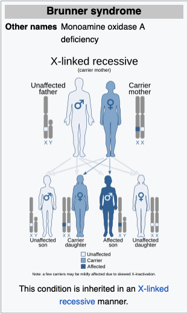
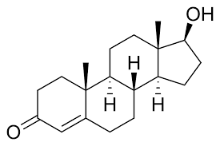
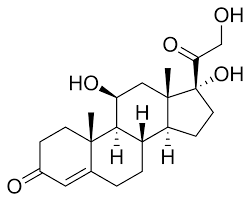
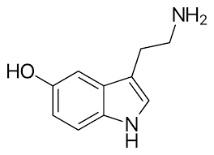
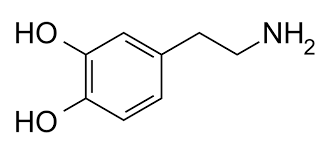
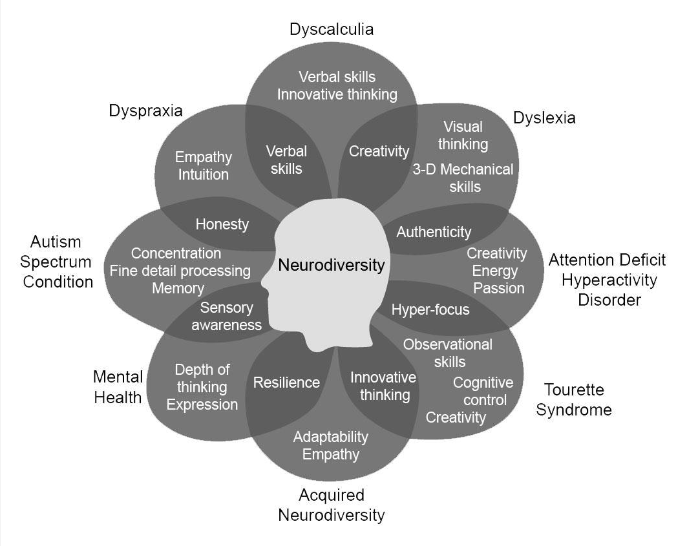

---
format:
  revealjs: 
    theme: styles.scss
    incremental: true 
    slide-number: true
    embed-resources: true
    self-contained: true
    show-notes: false
    preview-links: true
    transition: fade
---


#

::: {.title}

Modern Biopsychosocial Perspectives of Criminal Behavior

:::


# [Bio]{.blue}[Psycho]{.orange}[Social]{.blue2} {.center}


## [Bio]{.blue}[Psycho]{.orange}[Social]{.blue2} 

<br>

[Biological:]{.blue} Genetics, Autonomic Nervous System, Hormones, and so on

<br>

[Psychological:]{.orange} Psychopathy, Traits, Intelligence, and so on

<br>

[Sociological:]{.blue2} Economics, Environmental, Cultural Factors, and so on


# But really, this all comes down to measurement

#


::: footer

image: giphy

:::


# What kind of measurements?

## {auto-animate=true}

Family Studies

## {auto-animate=true}

Family Studies

Twin Studies 

## {auto-animate=true}


Family Studies

Twin Studies 

Adoption Studies

## {auto-animate=true}

Family Studies

Twin Studies 

Adoption Studies

Hormones

## {auto-animate=true}

Family Studies

Twin Studies 

Adoption Studies

Hormones

Neurotransmitters

## {auto-animate=true}

Family Studies

Twin Studies 

Adoption Studies

Hormones

Neurotransmitters

Brain Injuries 

## {auto-animate=true}

Family Studies

Twin Studies 

Adoption Studies

Hormones

Neurotransmitters

Brain Injuries 

Genetics 

## {auto-animate=true}

Family Studies

Twin Studies 

Adoption Studies

Hormones

Neurotransmitters

Brain Injuries 

Genetics 

<br>

[In other words, a lotttttt of stuff]{.blue }

#


::: footer

image: giphy

:::

# Relax, I got you

## Heredity/Genetics vs. The Environment 

In other words, sociologist based criminologist (*majority of the field*) vs. the biopsychosocial criminologist

<br>

Major argument was: how much of criminality is [inherited]{.blue2} from our parents (or ancestors) in comparison to how much of it is due to [only environmental factors]{.blue}

<br>

From this point forward, *we will consider heredity and genetics as interchangeable, but will mostly use genetics*


## Family Studies

:::: {.columns}

::: {.column width="70%"}

::: {.small-text}

[Brunner Syndrome (X-linked, MAOA gene mutation)](https://pubmed.ncbi.nlm.nih.gov/8211186/)

<br>

MAOA enzyme [critical for breaking down neurotransmitters (serotonin, dopamine, norepinephrine).]{.blue}

<br>

Characterized by [impulsive aggression (i.e., violent outbursts, antisocial behavior), mild intellectual disability, behavioral abnormalities (e.g., emotional dysregulation).]{.orange}

<br>

**Landmark case linking genetics to behavior.**

:::


:::

::: {.column width="30%"}



:::


:::


::: notes

**Original Study**: Dutch family with violent/antisocial male members exhibiting extreme impulsivity (e.g., arson, attempted rape) and borderline intellectual functioning. Female carriers showed no severe symptoms, consistent with X-linked recessive inheritance (males inherit mutated X chromosome from mother; females require two copies for full expression).   

**Debates**: Findings ignited debates on genetic determinism vs. free will. Critics warned against stigmatizing "criminal genes"; proponents highlighted potential for targeted therapies.   

**Behavioral Genetics**: Case underscored gene-environment interactions (e.g., trauma, upbringing) in shaping outcomes.  

**Brunner Syndrome & MAOA**: Inspired the "warrior gene" hypothesis (MAOA variants). Later research showed MAOA alone does not predestine behavior—environmental factors (e.g., childhood abuse) modulate risk.  

**X-linked recessive**: Inheritance pattern where males (XY) are affected if they inherit one mutated X-linked gene (from mother). Females (XX) require two mutated copies to exhibit the trait, making them predominantly carriers.

:::


## Adoption Studies


:::{.small-text}

[Compares adoptees to biological parents (genetic influence) and adoptive parents (environmental influence).]{.orange}

<br>

[Genetic predisposition:]{.blue} Higher similarity to bio-parents (e.g., criminal behavior in adoptees correlates with bio-parents’ history).

[Environmental factors:]{.red} Similarity to adoptive family (e.g., parenting style, trauma, socioeconomic status).

:::

<br>

:::{.smaller-text}

Adoptee with criminal behavior linked to bio-parents’ history → [genetic risk]{.blue}

Adoptee’s aggression mirrors adoptive siblings exposed to abuse → [environmental risk]{.red}

:::

# Phsysiology, Molecular Genetics, and Criminology 


## Autonomic Nervious System

::: {.column}
::: {.column width="70%"}

:::{.small-text}

A network of nerves regulating [unconscious bodily processes]{.blue}

<br>
 
Helps the body adapt to environmental changes, particularly during [danger or stress]{.red}

<br>

[Activates the "fight or flight" reaction to prepare the body for immediate action]{.orange}
 

:::

:::

:::{.column width="30%"}

{.absolute top=90 right=10 height="60%"}

:::


:::


## ANS and Psychopathy

[Low Resting Heart Rate Hypothesis:]{.blue}

Associated with increased antisocial behavior.

[May reflect reduced fear, facilitating risk-taking and antisocial acts]{.orange}

<br>

[Low Arousal Hypothesis:]{.blue}

Low ANS arousal may create an unpleasant 🙁 physiological state.

[Individuals may engage in stimulating or antisocial behaviors to increase arousal to optimal levels]{.orange}

## [Psychopathy]{.aqua}

{fig-align="center"}

::: footer

Image: Discovery Magazine

:::


::: notes

**Neurobiological:**  
 
Reduced amygdala activity (impaired fear/empathy).   

Prefrontal cortex dysfunction (poor impulse control).   

**GxE**  

Genetic: Heritable traits (e.g., callousness).   

Environmental: Childhood trauma, neglect, or abuse.   

**Outcome**   

High risk of criminal recidivism (e.g., 15-25% of incarcerated individuals meet psychopathy criteria).   

Treatment challenges: Traditional therapy often ineffective; focus on behavioral management.   

Corporate psychopathy: Traits linked to manipulative leadership (not always criminal).   

**Measures**

PCL-R: 20-item assessment (e.g., glibness, grandiosity, lack of guilt). Scores ≥30 indicate psychopathy.     

Psychopathy vs. ASPD: Psychopathy is a subset of antisocial personality disorder (ASPD) with added emotional deficits.   

Neurobiology: fMRI studies show reduced emotional processing in response to distress cues (e.g., crying faces).    

Key stat: Psychopaths are 3x more likely to reoffend violently post-release.     


:::


#


::: footer

image: giphy

:::

## [Psychopathy]{.aqua}

A type of antisocial behavior characterized by constellation of traits: 


[Callousness:]{.orange} Lack of empathy or concern for others' feelings

[Unemotionality:]{.orange}  Absence of emotional depth or responsiveness

[Manipulativeness:]{.orange}  Skilled at exploiting others for personal gain

[Impulsivity:]{.orange}  Acting without forethought or consideration of consequences

[Shallow Affect:]{.orange}  Superficial or limited emotional expression


## Resting Heart Rate

```{r}
countdown::countdown(minutes = 1,
                    color_border = "#FF7F50",
                    color_text = "#859ab2",
                    color_running_text = "white",
                    color_running_background = "#859ab2",
                    color_finished_text = "white",
                    color_finished_background = "#FF7F50",
                    top = 0,
                    margin = "0.2em",
                    font_size = "2em")
```

<br>

::: {.columns}

::: {.column width="50%"}


Check pulse 

<br>

*Watch the clock (15 seconds or 30 seconds) and count heart beats and multiply by 4 or 2*

<br>

Write it down

<br>


:::

::: {.column width="50%"}


:::

:::

## Survey 

```{r}
countdown::countdown(minutes = 1,
                    color_border = "#FF7F50",
                    color_text = "#859ab2",
                    color_running_text = "white",
                    color_running_background = "#859ab2",
                    color_finished_text = "white",
                    color_finished_background = "#FF7F50",
                    top = 0,
                    margin = "0.2em",
                    font_size = "2em")
```

<br>

[The Inventory of Callous-Unemotional Traits](https://arc.psych.wisc.edu/self-report/the-inventory-of-callous-unemotional-traits-icu/)

<br>

Higher scores 🧮 indicate higher Callous-Unemotional Traits!

<br>

The ICU has three subscales: Callousness, Uncaring, and Unemotional

<br>

Take your survey 


## Score and Analyze 

What was your heart rate at [rest?]{.blue}

<br>

What was your [score?]{.blue}

## 

{fig-align="center"}

::: footer

image: giphy

:::


# If you have a [lower heart rate at rest]{.blue} and [higher callousness scores]{.orange} chances are... 

## Drum Roll{.center}


::: footer

image: giphy

:::

# You're just a hungry college student who wants this class to end so you can go have lunch 🤪


## RECAP

Hand back Exam!

<br>

News 🗞️ incoming!!!

* I dropped twin studies from the lecture, won't be on any quiz or exam! Wooohooo! 


## Hormones 

Hormones are the body's chemical messengers that travel through the blood stream (think long range 🚀)

<br>

:::: {.columns}

::: {.column width="50%"}

[Testosterone]{.blue}

::: {.small-text}

The major sex hormone in males, essential to the development of male growth and masculine characteristics

:::



:::

::: {.column width="50%"}

[Cortisol]{.blue}

::: {.small-text}

The body's main stress hormone, involved in the 🤺 or 🛫 response. 

:::


:::

:::


## Hormones and Crime 

:::{.small-text}

[Testosterone]{.blue}

Linked to aggression, dominance, and risk-taking behaviors, specifically  violent and [impulsive]{.blue} crimes (e.g., assault). 

<br>

[Cortisol]{.blue}

Low levels tied to reduced fear, poor impulse control, and [sensation-seeking]{.blue}.

<br>

[Interaction Effect]{.orange}

([High]{.green} testosterone) x ([Low]{.red} cortisol)  = aggression and rule-breaking (e.g., "dual hormone hypothesis").

<br>

Here's a cool paper on the role of [testosterone, cortisol, and criminal behavior in men and women](https://www.sciencedirect.com/science/article/abs/pii/S0018506X22001544).


:::


## Neurotransmitters 

Chemical messengers that transmit signals between neurons (think short range 🧠)

:::: {.columns}

::: {.column width="50%"}

[Serotonin]{.blue}

::: {.small-text}

Often referred to as the 'feel-good' molecule - involved in mood regulation, sleep, appetite, learning, memory, and many other things. 

:::



:::


::: {.column width="50%"}

[Dopamine]{.blue}


::: {.small-text}

Released during pleasurable activities, essential for motivation, attention, mood, and even physical movement (e.g., Parkinson's disease is a result degradation of the dopamine producing cells). 

:::



:::

:::


## Neurotransmitters and Crime

:::{.smaller-text}

[Serotonin]{.blue}

Low serotonin levels have been associated depression & anxiety. 

Mostly associated with crimes due to mental health incident which can be homicide and/or suicide. Also, drug-related offenses.  

[Very famous paper regarding serotonin aka 5HT](https://pubmed.ncbi.nlm.nih.gov/12869766/) 

<br>

[Dopamine]{.blue}

Hyperactivity is associated with addiction, compulsive behaviors, or crimes tied to [sensation-seeking]{.blue}. 

Associated with antisocial personality disorders (e.g., psychopathy) and impulsive anti-social behavior. 

<br>


[Interaction Effect]{.orange}

([High]{.green} dopamine) x ([Low]{.red} serotonin) = heightened impulsivity and reward-driven aggression (e.g., "hot-tempered" vs. "cold-tempered" criminal acts)


:::


## Genetics x the Environment (GxE)

All the work showed that it is an [interaction]{.blue2} between the [moleculer genetics]{.orange} and the [environment]{.orange}

<br>

It's never [just]{.blue} genetics or [just]{.blue2} the environment. [Its both!]{.orange}

<br>

And finally, as we'll see, genetics isn't always a [bad]{.orange} thing.

<br>

It really just make peoples more sensitive or more resistant to the environment they are. 

## Neurodiversity

::: {.smaller-text}

[The natural variations in brain function that shape how individuals process information, perceive the world, and interact with others. These differences—shaped by evolutionary and developmental influence.]{.blue}

People experience and interact with the world around them in many ways, with [no one "right" way of thinking]{.orange}, learning, and behaving, and [differences are not deficits.]{.orange}

Read more at [Harvard Health](https://www.health.harvard.edu/blog/what-is-neurodiversity-202111232645).

:::

{fig-align="center"}

::: footer

image: National Library of Medicine

:::

## Differential Susceptibility

::: {.small-text}

[An evolutionary developmental theory proposing that genetic variation influences environmental sensitivity, shaping neurodiversity]{.blue}

:::

<br>

:::: {.columns}

::: {.column width="50%"}


{.absolute right=600 height="50%"}

:::

::: {.column width="50%"}


{.absolute height="50%" width="55%"}

:::


:::


## Sensitivity and Neurodiversity


::: {.smaller-text}

[**'Dandelion' Children**]{.blue}

Children who are [less reactive to their environments and are not as strongly affected by all experiences, both positive and negative]{.blue}

Can thrive in a wide range of circumstances and [more resistant]{.blue} to environmental variation

<br>

[**'Orchid' Children**]{.orchid}

Children who are [more sensitive to environmental factors and are more affected by all experiences, both positive and negative]{.orchid}

Can thrive in optimal circumstance that are [less resistant]{.orchid} to environmental variation. 

[*When given optimal circumstance they exceed in the [top percentile]{.orange} level*]{.orchid}

[When not optimal, they may be more susceptible to harsh effects of the environment they are in, and thus can lead to negative behavior outcomes]{.blue2}

:::

# Group Discussion!!!!

## Group Discussion 

```{r}
countdown::countdown(minutes = 10,
                    color_border = "#FF7F50",
                    color_text = "#859ab2",
                    color_running_text = "white",
                    color_running_background = "#859ab2",
                    color_finished_text = "white",
                    color_finished_background = "#FF7F50",
                    top = 0,
                    margin = "0.2em",
                    font_size = "2em")
```

:::{.small-text}

Studies suggest that both psychiatric interventions (e.g., Selective serotonin reuptake inhibitors) and mindfulness-based/holistic approaches can reduce symptoms related to antisocial behavior disorder. Given limited funding, should prison rehabilitation systems prioritize:

<br>

A.) [Pharmacological interventions (e.g., SSRIs) with social support programs]{.blue} 

<br>

B.) [Holistic interventions (e.g., meditation) with social support programs]{.orange}

<br>

Pick one and make an argument for your choice. Elect one speaker to present your point.

:::


## Policy

[Early Intervention Programs](https://pubmed.ncbi.nlm.nih.gov/16770765/) 

Evidence-based parenting support: Fund programs to promote sensitive, proactive parenting strategies (e.g., positive discipline, emotional regulation training).

<br>

[Nutritional Interventions for Crime Prevention](https://penntoday.upenn.edu/news/time-has-come-implement-omega-3-supplementation-reduce-aggression)

Integrate omega-3 fatty acids (e.g., fish oils) into at-risk youth diets, linked to improved impulse control and reduced aggression in clinical trials.

## Have a Great Break!

<br>

{fig-align="center"}


::: footer

image: giphy

:::