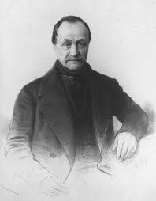
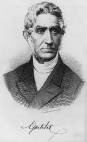
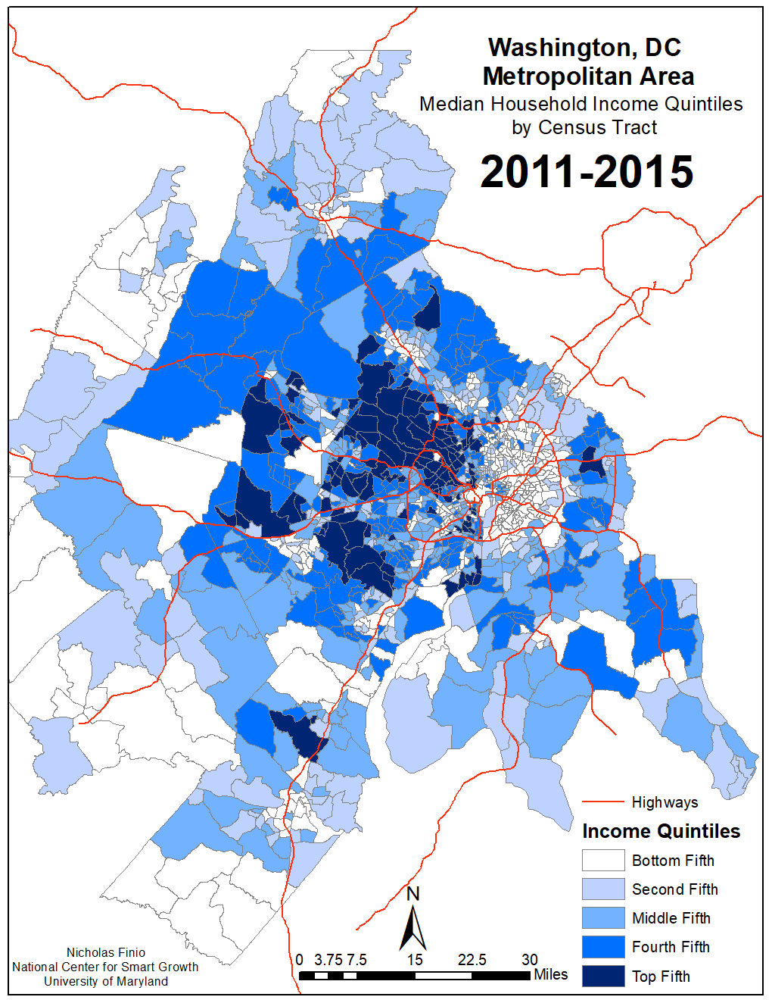
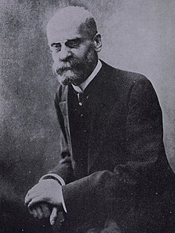
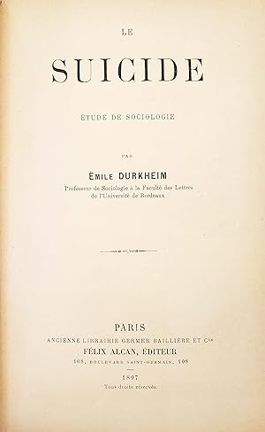

---
format:
  revealjs: 
    theme: styles.scss
    incremental: true 
    slide-number: true
    embed-resources: true
    self-contained: true
    show-notes: false
    preview-links: true
    transition: fade
---


#

::: {.title}

Early Social Structure and Strain Theories of Crime 

:::


## August Comte

::: {.columns}
::: {.column width="50%"}
::: {.smaller-text}

Coined the term "Sociology"

<br>

Developed the concepts:

<br>

[**Social Statics:**]{.blue} Study of *social order and stability* (e.g., structures, institutions, hierarchies).

<br>

[**Social Dynamics:**]{.blue} Study of *social change and progress* (e.g., evolution and development of social institutions).

<br>

[Example:]{.orange} Civil Rights Movement 

:::

:::

::: {.column width="50%"}

{fig-align="center"}

:::
:::

::: notes

**Social Statics Before Change:**

- Legal segregation: Jim Crow laws enforced racial segregation in schools, public spaces, and voting.

- Social norms: Widespread acceptance of racial hierarchy and discrimination in many parts of the U.S.

- Institutional structures: Unequal access to housing, employment, and education for Black Americans.

**Social Dynamics Driving Change:**

- Grassroots activism (e.g., Rosa Parks’ bus boycott, sit-ins, Freedom Rides).

- Leadership and mobilization (e.g., Martin Luther King Jr., the Southern Christian Leadership Conference).

- Legal challenges (e.g., Brown v. Board of Education overturning "separate but equal").

- Media exposure of racial violence (e.g., televised police brutality during the Selma marches).
    
**Legal changes: Civil Rights Act (1964), Voting Rights Act (1965), and Fair Housing Act (1968).**
:::

## Adolphe Quetelet (KAH-tay-lay)

::: {.columns}
::: {.column width="50%"}
::: {.smaller-text}

Belgian mathematician and sociologist; [introduced statistical methods to the social sciences.]{.blue}

<br>

[Relative Deprivation]{.blue}

The [perception of inequality or unfairness when individuals/groups compare their status to others in close proximity]{.blue}, fueling frustration and deviant behavior.

[Example:]{.orange} Washington DC and High crime rates, neighborhoods are adjacent to affluent areas reflect inequality and contribute to deprivation. 

:::

:::

::: {.column width="50%"}

{fig-align="center"}

:::

:::


::: notes

**Deprivation**  lacking or being denied certain resources or opportunities that are considered essential for a satisfactory standard of living. (e.g., prisons, neighborhoods, etc) ADD TO BOARD.   

**Relative Deprivation**

Resentment grows when disadvantaged groups directly witness others’ privilege (e.g., luxury goods, opportunities).

Policy Implication: Reducing spatial segregation and economic inequality may mitigate feelings of relative deprivation → lower crime.

:::

## Relative Deprivation

{fig-align="center"}

::: footer

Image: Greater Greater Washington

:::

## Émile Durkheim 


::: {.columns}
::: {.column width="50%"}
::: {.small-text}

French sociologist (1858–1917), often called one of the [founders of modern sociology]{.blue}

<br>

Emphasized empirical research and the importance of objective data (e.g., statistics) in studying social phenomena

<br>

His concepts (e.g., anomie) remain central to sociological theory, informing research on social integration, norms, and collective behavior


:::

:::

::: {.column width="50%"}

{fig-align="center"}

:::

:::


## Émile Durkheim and Anomie


::: {.small-text}

[Anomie]{.blue}

*A state of social instability ("normlessness") where societal norms, values, and regulations break down*, leading to: [confusion about acceptable behavior, alienation from community, increased deviance/crime]{.orange}

<br>

Key Causes/Triggers:

1.) [Rapid Social Change]{.blue2}

Industrialization, urbanization, or technological disruption

2.) [Economic Crises]{.blue2}

Sudden wealth inequality or unemployment (e.g., Great Depression)

3.) [Cultural Shifts]{.blue2}

Collapse of traditional values without new norms to replace them

:::


::: notes


**Modern Example: Social media** ➡️ causes alienation, crisis, and deviance.

Anomie (from Greek anomia = "without law") = A state of "normlessness" where society’s rules lose their power to regulate behavior, leading to confusion, alienation, and crisis.  

Durkheim’s Context: Developed in Suicide (1897) to explain how rapid social change destabilizes shared values, leaving individuals adrift without clear moral guidance.  


:::

## Émile Durkheim and Anomie

::: {.smaller-text}

[Collective Conscious]{.blue} the degree in which individuals of society are [think alike or have similar norms and values]{.blue}. Leads to social cohesion. 

Industrialization led Mechanical Societies into Organic Societies

|Mechanical Societies 🌾|Organic Societies 🏙️|
|----|----|
| Primitive | Modern |
| Rural | Urban|
| Agricultural based | Industrial based|
| Simple  division of labor| Complex division of labor (specialization focused)|
| Law used to enforce conformity| Law used to regulate division interactions|
| Stronger collective conscious| Weaker collective consciousness |


:::

::: notes

Def: 

Mechanical -> members perfrom the same functions (e.g., hunter and gather). Stronger collective conscious    

Organic -> distribution of labor is highly specified    

**Modern Examples shifting to organic:** 

Gig Economy: Lack of job security → blurred work-life boundaries.   

Social Media: Rapid cultural shifts → conflicting norms about privacy   

**Post-Pandemic Societies: Erosion of trust in institutions. lack of trust, conpiracy theory** 


Collective Consciousness Weakens: Diversity of roles → individualism rises.

Risk of Anomie: Breakdown of norms in rapid transitions (e.g., urbanization).

Modern Example: Gig economy (organic interdependence) vs. factory towns (mechanical cohesion).


:::


## Émile Durkheim and Anomie

1️⃣ Rapid Social Change (e.g., industrialization, economic booms/busts, technological disruption) ➡️

<br>

2️⃣ Breakdown of Norms (e.g., old rules lose relevance; new norms are absent/weak) ➡️

<br>

3️⃣ Anomie (i.e., “normlessness” – society fails to regulate goals/behavior) ➡️

<br>

🏁 Social Consequences  ️= ⬇️ Collective Conscious

::: notes

**Collective Conscious refers to the shared beliefs, values, norms, and moral attitudes that unify individuals within a society, acting as a social glue and shaping behavior**

::: 

## Émile Durkheim and Suicide


::: {.columns}
::: {.column width="50%"}


:::{.smaller-text}

In *Suicide* (1897), Durkheim examined how [social integration and regulation affect suicide rates]{.aqua}

He [examined popular religious groups]{.blue2} in that time, and found that Catholics, with *stronger social bonds*, had lower suicide rates than Protestants, *who experienced weaker collective ties*

Showed that [when social norms weaken (i.e., anomie occurs) the risk of suicide increases.]{.blue} Thus, [social factors influence individual behavior]{.orange}

Keep in mind that in 1897, societal attitudes toward suicide were still largely dogmatic, often regarding it both as a grave moral failing and a criminal act


:::

:::

::: {.column width="50%"}

{fig-align="center"}

:::

:::


::: notes


Durkheim argues that suicide is not simply an individual act of despair but a social phenomenon influenced by factors like social integration, regulation, and the nature of social bonds

One of the most influential 

**First to demonstrate that it was the rapid development of society that led to one of the worst deviant acts at that time, a highly dogmatic religious time, was responsible.**  

In 1897 suicide had a much stronger moral and social stigma to it. For example, people weren't allowed proper burial or they were public humiliated, excommunicated, etc...


:::

## Émile Durkheim and Suicide


:::{.small-text}

**Why this matters:**

<br>

1️⃣ [Societal conditions can drive individual behaviors like suicide or other forms of deviance]{.blue}

<br>

2️⃣ Which emphasizes that personal acts or crimes often [stem from broader social forces such as weakened communal bonds or unclear expectations]{.blue}

<br>

3️⃣ Durkheim’s work shifts focus [away from purely individual explanations(e.g., mental illness)]{.blue} and toward understanding how social structures, norms, and the level of integration within a community influence behavior

:::

## Key point here!! 

<br>


Durkheim’s concept of [anomie]{.blue} and the [importance of collective consciousness highlight that broader social structures]{.blue} — *rather than purely personal factors* — can [powerfully shape individual behaviors]{.orange}.

<br>

# Group Discussion!!!!

## Group Discussion 

```{r}
countdown::countdown(minutes = 10,
                    color_border = "#FF7F50",
                    color_text = "#859ab2",
                    color_running_text = "white",
                    color_running_background = "#859ab2",
                    color_finished_text = "white",
                    color_finished_background = "#FF7F50",
                    top = 0,
                    margin = "0.2em",
                    font_size = "2em")
```

:::{.small-text}

During the COVID-19 pandemic, lockdowns disrupted established social structures (e.g., remote work, virtual education, restricted social interaction). In your view, [did these abrupt shifts in societal norms create widespread feelings of anomie (normlessness or alienation)?]{.orange}

<br>

[If yes, what new or intensified forms of deviance emerged as a result of this destabilization? ]{.blue}

[If no, what societal mechanisms prevented anomie from taking hold?]{.blue2}

<br>

Pick one and make an argument for your choice. Elect one speaker to present your point.

:::


::: notes

A state of social instability (“normlessness”) where societal norms, values, and regulations break down   

Protests, digital misconduct, quarantine violations, conspiracy theories, or cybercrime    

Collective resilience, adaptive institutions, informal social controls   

Did virtual communities, mutual aid networks, or government policies restore a sense of order?
 

:::


# Strain Theories

## A Hypothetical  

Who achieved success in American Society? 

<br>

- [Scenario A.]{.blue} John, who has a PhD in physics, lives in a one-bedroom apartment because his postdoc position pays 25k a year, additionally has 150,000 in student debt 


- [Scenario B.]{.blue} Joe, who is a relatively successful drug dealer who lives in a four-bedroom home, drives a Hummer, dropped out of high school in 10th grade, and makes more than 90k a year.


::: notes

Scenario B achieved the american dream with little care in how it was achieved 

:::

## Merton's Strain Theory 

::: {.smaller-text}

Robert K. Merton (1938)

<br>


[Expanded on Durkheim’s concept of anomie]{.blue}

A state of "normlessness" caused by [rapid social change (e.g., industrialization)]{.blue}, where societal rules collapse, leading to deviance

<br>

[Merton's Concept of Strain]{.orange}


Anomie is the structural strain itself - [the imbalance between society’s emphasis on cultural goals (wealth, success) and the lack of access to legitimate institutionalized means (education, jobs) to achieve them]{.orange}, which leads to deviance

:::


::: notes

Societal emphasis on cultural goals (e.g., wealth) outweighs access to legitimate means to achieve those goals


:::

## Merton’s Strain Theory

[Cultural Goals:]{.blue} Societal aspirations (e.g., wealth, success)

<br>

[Institutionalized Means:]{.blue} Legitimate paths to achieve goals (e.g., education, hard work)

<br>

[Strain:]{.orange} Disconnect between cultural goals and access to institutionalized means

<br>

[Anomie:]{.blue} Normlessness due to societal pressure/breakdown which leads to deviance


## Merton's Strain Theory 

::: {.smaller-text}

These [adaptations]{.blue} reflect responses to the strain between society’s emphasis on success (goals) and unequal access to legitimate opportunities (means)

<br>

[Conformity:]{.blue} Accepts both societal goals and legitimate means (e.g., pursuing wealth through education/hard work)

[Innovation:]{.blue} Accepts cultural goals but uses illegitimate means to achieve them (e.g., theft, fraud)

[Ritualism:]{.blue} Abandons cultural goals but rigidly follows institutionalized means (e.g., bureaucratic workers “going through the motions”)

[Retreatism:]{.blue} Rejects both goals and means, withdrawing from society (e.g., substance abuse, homelessness)

[Rebellion:]{.blue} Rejects societal goals and means, replacing them with new ones (e.g., revolutionaries seeking to overthrow systems)


:::

## Five Adaptations to Strain 

::: {.small-text}

| Mode        | Accept Goals? | Accept Means? | Example                      |
|-------------|---------------|---------------|------------------------------|
| [Conformity]{.blue}   | Yes           | Yes           | Pursue career via education |
| [Innovation]{.blue}   | Yes           | No            | Drug trade for wealth       |
| [Ritualism]{.blue}    | No            | Yes           | Bureaucrat follows rules rigidly |
| [Retreatism]{.blue}   | No            | No            | Substance abuse, dropout    |
| [Rebellion]{.blue}    | *Replace*     | *Replace*     | Revolutionary movements     |

:::

## General Strain Theory 

Robert Agnew (1992)

<br>

Key Shift from Merton:

<br>


Strain is [not just structural (goals vs. means)]{.blue} but [individual-level]{.orange}

<br>

[Strain ➡️  Negative emotion (anger) ➡️  deviance]{.orange}


::: notes

Draw on board as you go through


:::

## Three Types of Strain 


::: {.small-text}

1️⃣ [ Failure to Achieve Goals]{.blue}

Disjunction between expectations and reality

Example: Poor grades despite effort

<br>

2️⃣  [ Removal of Positive Stimuli]{.blue}

Loss of valued resources 

Example: Loss of a loved one, breakup

<br>

3️⃣  [ Presence of Negative Stimuli]{.blue}

Exposure to harm 

Example: Abuse, bullying, discrimination.

:::

## How Strain Leads to Deviance

:::{.small-text}

[Strain ➡️  Negative emotion (anger) ➡️  deviance]{.orange}

<br>

The link between negative emotion and deviance [depends on coping mechanisms:]{.blue}

<br>

⑴ [Legitimate Coping:]{.aqua} Therapy, exercise, social support

<br>

⑵ [Illegitimate Coping:]{.aqua} Drug use, violence, theft

<br>


[Lack of access to legitimate coping resources]{.blue2} (e.g., financial stability, mentorship, mental health support) increases the likelihood of deviant behavior.


:::

## Comparing Merton and GST

<br>


|Merton (1938) |GST (Agnew, 1992)️|
|----|----|
| Structural goals | Individual-level strains |  
| Inability to achieve goals legitimately | Negative relationships/experiences | 
| 5 modes of adaptation  | Anger/frustration and coping mechanisms | 


# Group Discussion!!!!

## Group Discussion 

```{r}
countdown::countdown(minutes = 10,
                    color_border = "#FF7F50",
                    color_text = "#859ab2",
                    color_running_text = "white",
                    color_running_background = "#859ab2",
                    color_finished_text = "white",
                    color_finished_background = "#FF7F50",
                    top = 0,
                    margin = "0.2em",
                    font_size = "2em")
```


:::{.small-text}

With what we just learned about General Strain Theory, [come up with an idea for a product (e.g., app, social media group, website, etc...) that would help individuals access [legitimate coping resources]{.orange} (e.g., therapy, exercise, social support) during negative emotional events (like anger) before they escalate to deviance]{.blue}. 

For example, a meditation app that alerts users during heart rate spikes from stress induced anxiety.

<br>


[Have fun with it! Think outside the 📦]{.orange}


<br>

Elect one speaker to present your point.


:::

## Have a great weekend! 


::: footer

image: giphy

:::