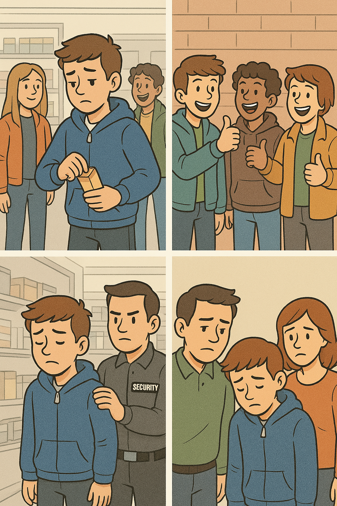
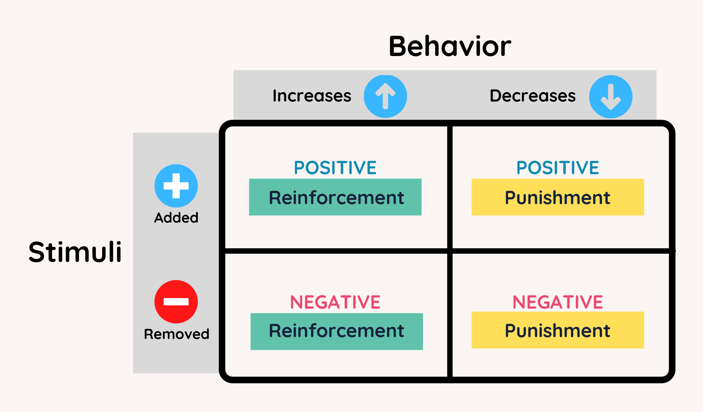
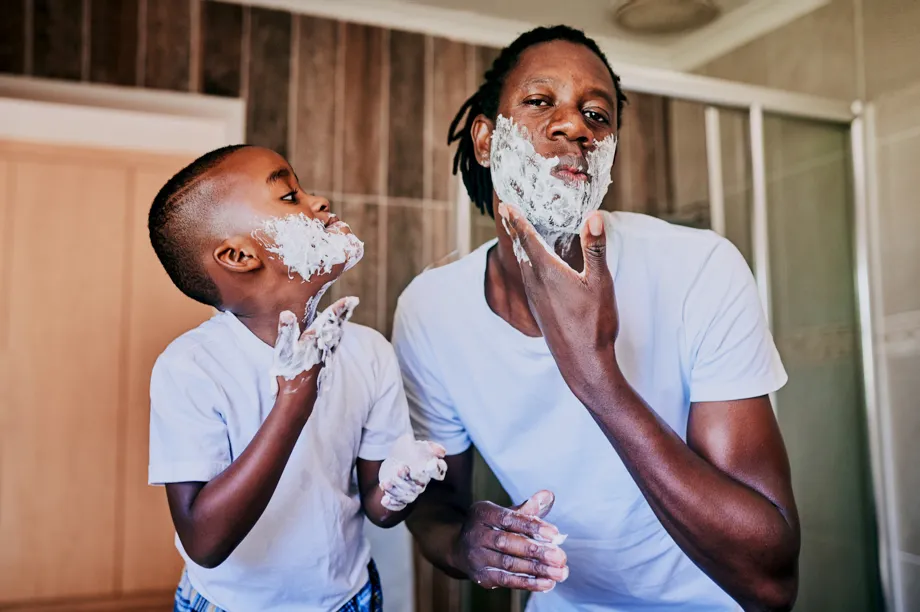
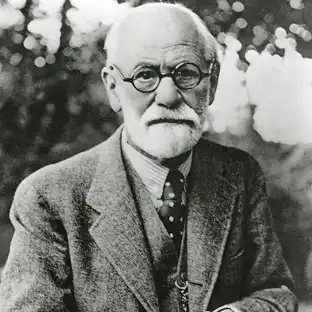

---
format:
  revealjs: 
    theme: styles.scss
    incremental: true 
    slide-number: true
    embed-resources: true
    self-contained: true
    show-notes: false
    preview-links: true
    transition: fade
---


#

::: {.title}

Learning and Control Theories of Crime


:::

## How Did We Arrive Here?

:::{.smaller-text}

Early criminology emphasized biological explanations of crime (e.g., the belief that some individuals were “born criminals”).

<br>

[Durkheim challenged this view]{.blue}, arguing that [crime is a normal and inevitable part of society shaped by **social conditions**, not biology]{.blue2}

<br>

He showed that changes in [social integration and regulation (e.g., weakened collective conscience, anomie) influence when and where crime occurs]{.violet}

<br>

This shifted the focus from [**individual traits** to the **social environment**]{.violet}

<br>

[If crime is shaped by our **social world**, then **criminal behavior can be learned** through interaction with others]{.orange}

:::

## Moderators

:::{.small-text}

<br>

[Moderators]{.blue2} are factors that affect the [strength or direction of a relationship between two variables]{.green}

<br>

[They do not change the basic relationship itself, they influence **how strongly** one variable impacts another]{.orange}

<br>

A moderator answers the question,  

<br>

[“Under what conditions will this effect be stronger or weaker?]{.blue2}

:::


## Learning Theories 

:::{.small-text}

Behavior is [learned through interaction with others]{.blue} 

<br>

When you hear "learning theories" think [peers!]{.orange}

<br>

[Critical Assumption:]{style="text-decoration: underline;"}

<br>

People are assumed to start as “blank slates” ('tabula rasa') – [no tendency toward or away from committing crime]{.blue2}

<br>

Thus, criminal behavior is [learned]{.blue2}, NOT inherited.

:::

## Differential Association Theory 

:::{.small-text}

Edwin Sutherland (1930s)

*“A person becomes delinquent because of an excess of definitions favorable to law violation over definitions unfavorable to law violation.”*

<br>

Learned primarily through [interaction with close personal groups (e.g., peers)]{.blue}

<br>

[**Exposure** to attitudes and values either favorable or unfavorable to law]{.blue2} shapes an individual’s propensity to commit crime

The [intensity, duration, frequency, and priority]{.orange} of these associations determine their influence

:::


## Differential Association Theory 

:::{.small-text}

The [intensity, duration, frequency, and priority]{.orange} of these associations moderate peer-influence on behavior

<br>

1️⃣ [Intensity]{.orange} - How emotionally important the relationship is  

<br>

2️⃣ [Duration]{.orange} - How long the relationship has existed

<br>

3️⃣ [Frequency]{.orange} - How often the interaction occurs

<br>

4️⃣ [Priority]{.orange} - How early in life the relationship formed

:::

## Differential Reinforcement Theory 


:::{.smaller-text}

**Robert Burgess & Ronald Akers**

<br>

People learn to continue or discontinue behaviors based on the [rewards and punishments they experience]{.orange}

<br>

The social environment provides both [definitions (what is right or wrong)]{.blue} and [reinforcements (approval, praise, ridicule, sanctions)]{.blue2}

<br>

If a behavior is **rewarded**, it is more likely to be repeated

If it is **punished**, it becomes less likely

<br>

This is what is called [operant conditioning]{.green}

:::

::: notes

REINFORCEMENTS comes into play


:::

# Let's See What AI Thinks This Looks Like 🤖

## Differential Reinforcement Theory 🤖 Image

::: {.columns}
::: {.column width="60%"}
::: {.smaller-text}

1️⃣ A teen hangs out w/ group of peers who regularly shoplift 

2️⃣ The first time the teen shoplifts, they feel nervous - but the [group praises]{.green}

That [positive reinforcement (peer approval) increases the likelihood they’ll do it again]{.green}

3️⃣ Later, the teen is caught by store security and receives a suspension from school, along with [disappointment from their parents]{.red} 

4️⃣ This [negative consequence (punishment) makes them reconsider the behavior]{.red}

:::

:::

::: {.column width="40%"}

{.absolute top=150 right=0 height="70%"}

:::
:::

## Operant Conditioning 

::: {.columns}
::: {.column width="60%"}
::: {.smaller-text}

**B. F. Skinner**


Explains [how]{.blue} behavior is shaped by consequences in the environment

<br>

[Positive Reinforcement]{.blue}: Adding something [good after a behavior, which then increases behavior]{.blue} 

<br>

[Negative Reinforcement]{.blue2}: Removing something [unpleasant after a behavior, which then increases behavior]{.blue2}

<br>

[Punishment:]{.aqua} Adding something [unpleasant OR taking away something good, to decrease behavior]{.aqua}

:::

:::

::: {.column width="40%"}

{.absolute top=170 left=650 height="50%" width="45%"}

:::
:::


## Modeling and Imitation

::: {.columns}
::: {.column width="50%"}
::: {.small-text}

<br>

Individuals learn not only from direct rewards/punishments but [also from observing others’ behavior and its consequences]{.blue}

<br>

If a role model is [seen being rewarded (or not punished) for criminal behavior, observers are more likely to imitate that behavior]{.blue2}


:::
:::

::: {.column width="50%"}

<br>

{fig-align="center"}
:::


:::


## Neutralization Theory 

**Gresham Sykes & David Matza (1957)**

<br>

Core Idea: Delinquents often [drift between conventional and deviant behaviors rather than being committed to criminality full-time]{.blue}

<br>

While they generally accept mainstream moral values, they use [justifications or 'techniques of neutralization']{.blue} to [temporarily suspend or neutralize these values when engaging in delinquency]{.orange}

## Techniques of Neutralization  

:::{.smallest-text}

[Denial of Responsibility]{.blue}

Diminishing personal accountability

Example: “It wasn’t my fault; I was just following orders.”

[Denial of Injury]{.blue}

Offenders minimize or deny the harm, suggesting no real injury occurred

Example: “No one really got hurt,” or “They can afford the loss.”

[Denial of the Victim]{.blue}

Victim deserved the harm or that there is no true victim

Example: “They had it coming.”

[Condemnation of the Condemners]{.blue}

Shifts blame to those who disapprove of the act, accusing them of being hypocritical

Example: “You’ve done worse things yourself.”

[Appeal to Higher Loyalties]{.blue}

Argues that their actions serve a greater good 

Example: “I did it for my family/friends,” or “My loyalty to the group takes priority.”

:::

::: notes

These are also useful in arguments or when watching debates. 

For more info: [Carl Sagan Balony Detection](https://www.inf.fu-berlin.de/lehre/pmo/eng/Sagan-Baloney.pdf)


:::

# Group Discussion!!!!

## Group Discussion 

```{r}
countdown::countdown(minutes = 10,
                    color_border = "#FF7F50",
                    color_text = "#859ab2",
                    color_running_text = "white",
                    color_running_background = "#859ab2",
                    color_finished_text = "white",
                    color_finished_background = "#FF7F50",
                    top = 0,
                    margin = "0.2em",
                    font_size = "2em")
```

:::{.smaller-text}

Platforms like TikTok can reward instant gratification (e.g., likes, shares, follower increases), [which may unintentionally normalize or incentivize deviant or harmful behaviors]{.blue}

<br>

If this reinforcement cycle contributes to deviant behavior, [what platform-level strategy (e.g., slowing or hiding like counts)]{.orange} [could reduce this reinforcement without significantly decreasing user engagement?]{.blue2}

<br>

For example, content warnings and rating labels were added to films in the 1970s to guide audiences

<br>

Pick one and make an argument for your choice. Elect one speaker to present your point

:::


# Control Theories 


## Sigmond Freud 


::: {.columns}
::: {.column width="60%"}

:::{.smaller-text}

Austrian neurologist

Founder of [psychoanalysis]{.blue} -  a method for treating mental illness and understanding the human psyche

Proposed a [tripartite model]{.blue} - id, ego, and superego 

Emphasized the role of the [unconscious]{.blue} shaping behavior

Believed dreams are expressions of unconscious wishes, detailed in *The Interpretation of Dreams (1900)*

[Introduced defense mechanism concepts]{.blue} like repression, denial, and projection to explain ego protection


:::

:::

::: {.column width="40%"}



:::

:::


## Freud's Tripartite Model 


:::{.smallest-text}

[Ego]{.blue} - *Conscious*

[Rational mediator between Id and Superego]{.blue}

Operates on the [reality principle]{.blue} - evaluate the world and act accordingly by delaying gratification and considering consequences

Assesses the external world and balances competing demands

<br>

[Superego]{.aqua} - *Pre-conscious*

Internalization of [societal norms and moral standards]{.aqua}

Strives for perfection

Generates feelings of guilt


<br>

[Id]{.blue2} - *Unconscious*

[Innate and primitive]{.blue2}

Driven by the pleasure principle (immediate gratification)

Highly impulsive

Present at birth


    
:::

## Freud's Iceberg Metaphor

::: {.smaller-text}

"The mind is like an iceberg, it floats with one-seventh of its bulk above water.”

<br>

:::

{fig-align="center"}

::: notes

This theory led to a great deal of development in the control theories of criminology. 

As we'll see a theorist applied these ideas to early control theories


:::


::: footer

Image: Medium

:::

## Freud's Concepts 

<br>

[Many of Freud's concepts have been rejected in modern psychology]{.blue}

<br>

And much of his work was untestable

<br>

Although his work was highly influential and influenced many criminological idea 


## Connection to Control Theories

::: {.small-text}

[Internal Control Mechanism:]{.blue}

A [strong superego (id becomes non-dominate)]{.red} acts as an internal [brake]{.red} against deviance

A [weak superego]{.green} may lead to [poor impulse control (id becomes dominate)]{.green} which can which reduces adherence to social bonds and increase likelihood of deviance

<br> 

[Superego is Developed by Social Bonds:]{.blue}

Socialization (e.g., family, education) shapes the superego 


:::

::: notes

Freud’s theory underscores the psychological roots of internalized control, bridging individual psychology and societal influences on criminal behavior.

:::

## Toby's Stake in Conformity

::: {.columns}
::: {.column width="60%"}
::: {.small-text}

Jackson Toby

<br>

[Stake in conformity]{.blue}

Refers to an [individual’s personal investment]{.blue} (e.g., family, friends) in adhering to social norms and avoiding deviant behavior

<br>

[The more an individual stands to lose by violating rules (reputation, job, relationships), the higher their stake in conformity]{.orange}

:::
:::

::: {.column width="40%"}


:::
:::

::: footer

Image: Rutgers 

:::


## Reckless’s Control Theory

:::{.smallest-text}

Explains [why individuals resist]{.orange} criminal behavior 

When [inner and outer containment are strong, the resistance is strong]{.orange}

<br>

[Inner Containment (Prevents Pushes)]{.blue2}

Strong self-concept and sense of identity

Personal self-control, moral compass, and conscience

<br>

[Outer Containment (Prevents Pulls)]{.blue2}

Social structures (family, community, peer support)

Consistent enforcement of norms and rules
    
<br>

[Pushes and Pulls Toward Deviance]{.blue}

Pushes: [Internal]{.blue} drives or impulses (e.g., frustration, rebellion)  

Pulls: [External]{.blue} lures (e.g., gang influence, media glamorization of deviance)  

:::


## Hirschi’s Social Bonding Theory


:::{.smallest-text}

Travis Hirschi (1969)

The [stronger an individual’s attachment, commitment, involvement, and belief in societal norms, the less likely they are to engage in deviant or criminal behavior]{.blue}


[Key Elements of the Social Bond]{style="text-decoration: underline;"}

<br>

1️⃣ [Attachment]{.orange}

Emotional closeness to significant others (family, friends), desire to maintain these bond

<br>

2️⃣ [Commitment]{.orange}

Investment in conventional goals (education, career), fear of losing what’s been achieved

<br>

3️⃣ [Involvement]{.orange}

Time spent in productive or prosocial activities, 'Idle hands' are minimized

<br>

4️⃣ [Belief]{.orange}

Acceptance of societal rules and moral values, strong internalization of norms 

:::


## Hirschi’s Low Self-Control Theory


:::{.smaller-text}

Gottfredson & Hirschi

Proposes that [low self-control]{.aqua}, [in the presence of criminal opportunity]{.blue2}, [leads to deviant or criminal behavior]{.blue}

<br>

[Two major Elements]{style="text-decoration: underline;"}

<br>

[Low Self-Control]{.blue}

Characterized by [impulsivity]{.blue}, preference for simple tasks, risk-seeking, and insensitivity to others

Largely established early in childhood (through inadequate socialization)

<br>

[Opportunity]{.blue}

Situations where rules can be violated with minimal risk

:::


## Hirschi’s Low Self-Control Theory

:::{.small-text}

[Development of Low Self-Control]{style="text-decoration: underline;"}

<br>

[Socialization]{.orange}

Effective child-rearing and socialization can foster higher self-control

Inadequate parenting increases the likelihood of low self-control

<br>
        
[Stability Over Time]{.orange}

Remains stable through life

:::


## Kahoot 🦉

[Here](https://play.kahoot.it/v2/?quizId=6366fcbb-600f-4623-a808-dedd8944eac7)


## Good Luck Studying!!


::: footer

Image: Giphy

:::