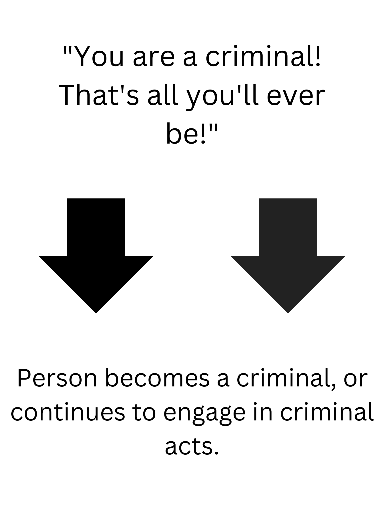
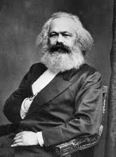

---
format:
  revealjs: 
    theme: styles.scss
    incremental: true 
    slide-number: true
    embed-resources: true
    self-contained: true
    show-notes: false
    preview-links: true
    transition: fade
---


#

::: {.title}

Social Reaction and Critical Models of Crime


:::

# Labeling Theory 

## Labeling Theory 

<br>

::: {.columns}
::: {.column width="50%"}

:::{.small-text}

[No act is inherently deviant - deviance is created by social reactions]{.blue}

<br>

“Deviant” labels are socially applied

<br>

Once labeled, [individuals may see themselves through that deviant label]{.blue2}

:::

:::


::: {.column width="50%"}


{.absolute top=130 right=40 height="70%"}

:::


:::


## Primary vs. Secondary Deviance

:::{.smaller-text}

[Primary Deviance:]{.blue}

Initial, [often minor rule-breaking]{.orange} (e.g., underage drinking) that typically doesn’t alter self-image

<br>

Example: A teen shoplifts once, isn’t caught, doesn’t adopt a “thief” identity

<br>

[Secondary Deviance:]{.blue} 

[Further deviance caused by society’s reaction and the internalization of a deviant label]{.orange}

<br>

Example: The teen is publicly labeled a “thief,” shunned, and then embraces that identity by committing more thefts

:::

## The Labeling Process

<br>

:::{.small-text}

1️⃣ [Initial Act (Primary Deviance):]{.blue} Usually minor, goes unnoticed or unpunished

<br>

2️⃣ [Detection & Labeling:]{.blue} Authorities or community apply a formal deviant label

<br>

3️⃣ [Stigmatization:]{.blue} Person faces social rejection; opportunities narrow

<br>

4️⃣ [Internalization:]{.blue} The label becomes part of self-identity, fueling continued deviance [(Secondary Deviance)]{.blue}

:::

::: notes

Self-Fulfilling Prophecy: Harsh labeling can deepen criminal behavior


:::


## Criticisms of Labeling Theory

<br>

Overlooks [why]{.blue} deviance starts in the first place

<br>

Often used alongside other theories to fully explain criminal behavior

<br>

Difficult to test empirically

    
# Marxist Criminology 

## Russian Revolution of 1917

:::{.smaller-text}

Economic inequalities between the bourgeoisie and the proletariat

<br>

[Bourgeoisie class]{.blue} - ruling class that owns the means of production

<br>

[Proletariat class]{.blue} - working class that sells their labor

<br>

 *The Communist Manifesto* (1848), inspired many to believe that a proletarian-led revolution could overthrow the Bourgeoisie class and abolish the idea of private property and creating a [classless society]{.blue}
 
 <br>

*Das Kapital* (1867) explored how workers are exploited through production - the actual process of work. Argued that the capitalist purchased [labourers' capacity to work, not their labour]{.blue}

:::


::: notes 

Workers faced low wages, poor working conditions, and lacked social mobility


:::


## Russian Revolution of 1917

 <br>

:::{.smaller-text}

1️⃣ [February Revolution]{.blue} - Overthrew the Tsar Nicholas II

<br>

2️⃣ [October Revolution]{.blue} - Led by the Bolsheviks under Vladimir Lenin, this second revolution placed power in the hands of the Soviets (worker councils), marking the first major communist state   

<br>

A civil war between the Bolshevik Red Army and anti-Bolshevik forces ensued

<br>
 
The Bolsheviks emerged victorious, establishing the Union of Soviet Socialist Republics (USSR) around 1922

:::


## Marxist Criminology 


::: {.columns}
::: {.column width="50%"}
:::{.smallest-text}

<br>

Examines how crime and law are shaped by social and economic structures, emphasizing [class conflict]{.blue}

<br>

Major tenants: 

[Capitalism fosters an environment of competition and inequality, which leads to criminal behavior within the economic system]{.orange}

Laws are created and enforced in ways that protect the interests of the [bourgeoisie (ruling class) and maintain their dominance over the proletariat (working class)]{.orange}

<br>

Criticisms: 

Too simplistic. It is unlikely that capitilism is the only casues of crime, and that a socialist economy would solve all crime. 


:::

:::

::: {.column width="50%"}

{.absolute top=130 right=40 height="70%"}


:::

:::


# Group Discussion!!!!

## Group Discussion 

```{r}
countdown::countdown(minutes = 10,
                    color_border = "#FF7F50",
                    color_text = "#859ab2",
                    color_running_text = "white",
                    color_running_background = "#859ab2",
                    color_finished_text = "white",
                    color_finished_background = "#FF7F50",
                    top = 0,
                    margin = "0.2em",
                    font_size = "2em")
```

:::{.smaller-text}

<br>

[How might the revolutionary ideas that led to the Russian Revolution of 1917 compare to today’s political and social movements]{.blue} — such as “Hands Off” protests, concerns over an economic recession, healthcare debates, or the funding pressures faced by Columbia amid Palestinian protests?

<br>

In your view, [can any contemporary acts of civil disobedience or crime be explained through a Marxist lens]{.blue}, and if so, [would those actions be justifiable?]{.orange}

<br>

Make a stance on the justice element and have an argument for your choice. Elect one speaker to present your point.

<br>

Speak your mind! 


:::

# Questions before exam?


## Good luck studying

{fig-align="center"}

::: footer

image: giphy

:::