---
format:
  revealjs: 
    theme: styles.scss
    incremental: true 
    slide-number: true
    embed-resources: true
    self-contained: true
    show-notes: false
    preview-links: true
    transition: fade
---

# Let's check out some of the submissions

## Aruzhan's Submission

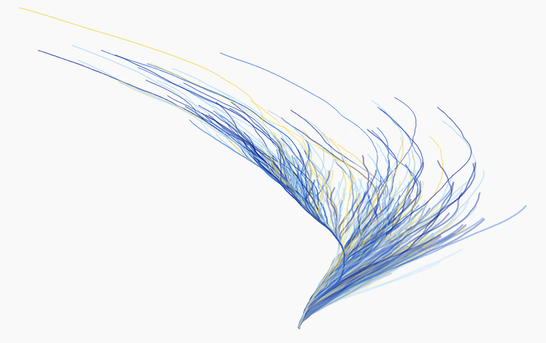{.absolute top=170 left=100 height="30%"}

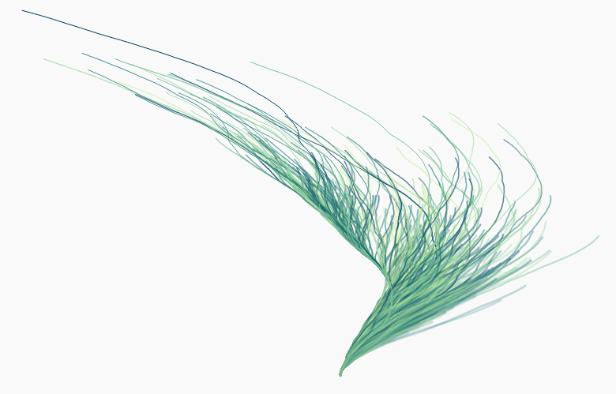{.absolute top=400 left=100 height="30%"}

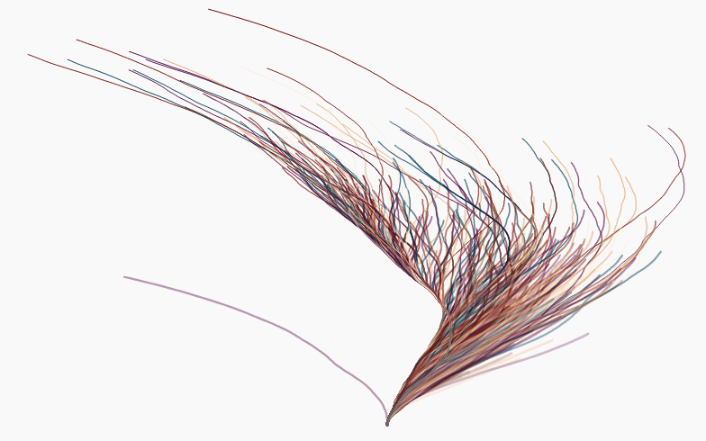{.absolute top=170 left=550 height="30%"}

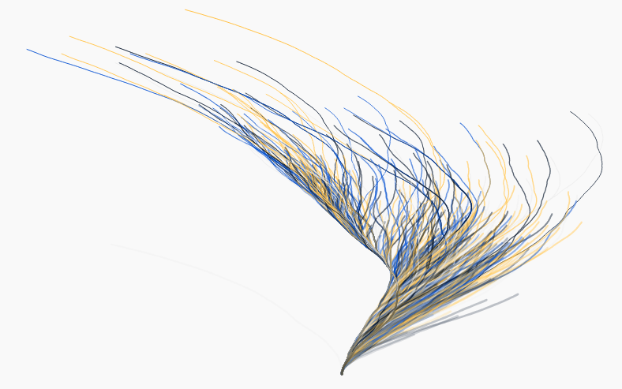{.absolute top=400 left=550 height="30%"}

## Mario's Submission

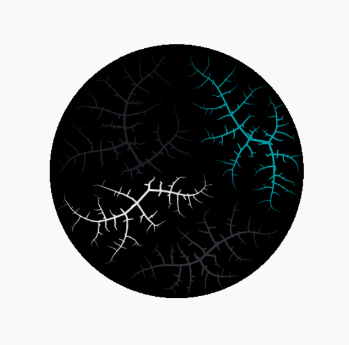{.absolute left=250 height="70%"}

## Kenya's Submission

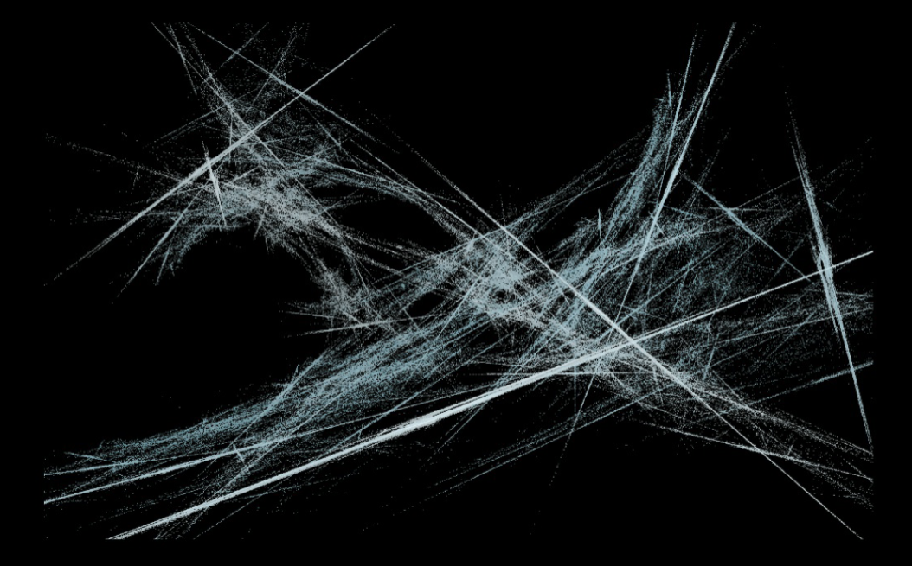{.absolute left=100 height="70%"}

## Serafim's Submission

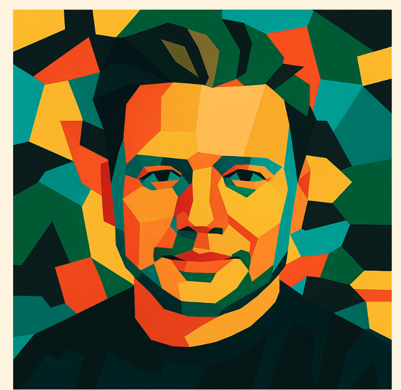{.absolute left=250 height="70%"}

## Zach's Submission

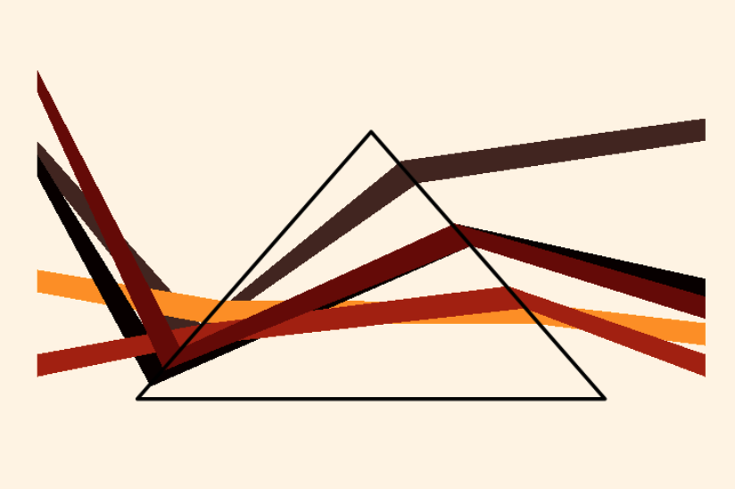{.absolute left=100 height="70%"}

## Ethan's Submission 

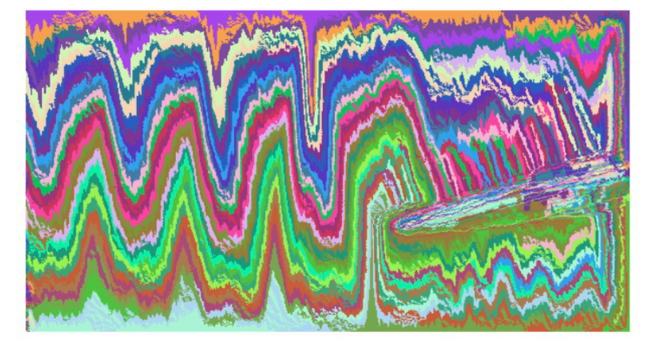{.absolute left=100 height="70%"}

## Zoe's Submission 

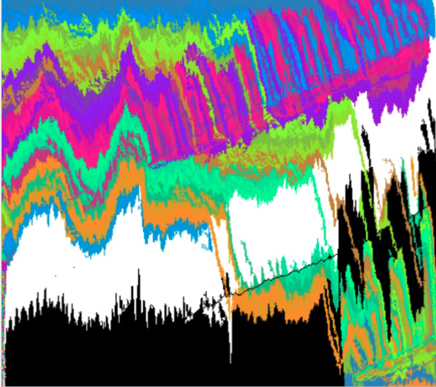{.absolute left=220 height="70%"}

## Perla's Submission

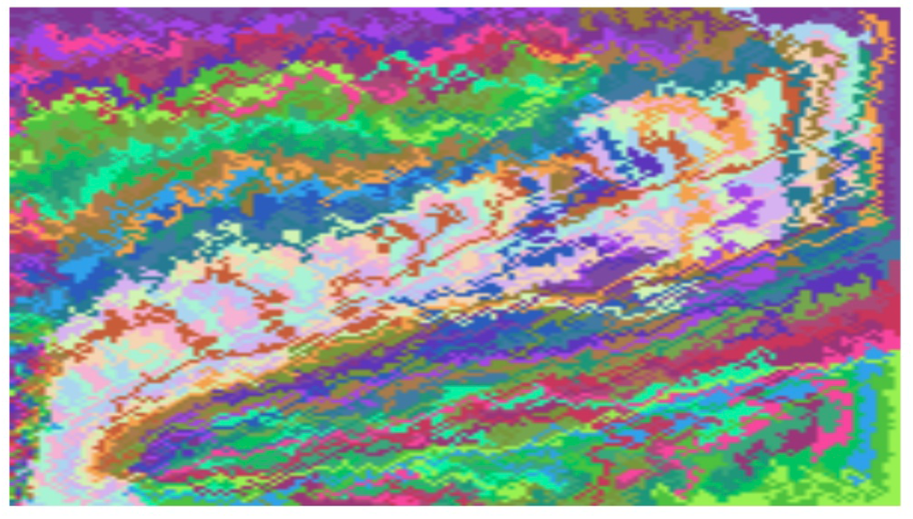{.absolute left=100 height="70%"}

## Addie's Submission

{.absolute left=250 height="75%"}

## Cassidy's Submission 

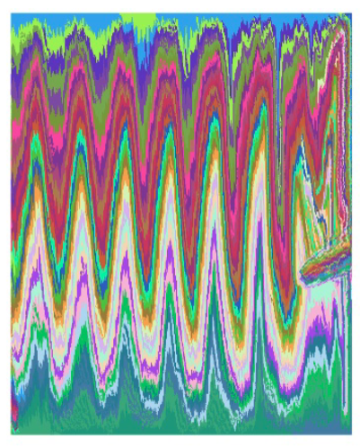{.absolute left=250 height="75%"}

## Data Visualization and Careers 

:::{.small-text}

[**It's a great hobby! It helps alleviate anxiety! And with practice, you can make a career out of it.**]{.orange}

 

The university offers a course on [data viz](https://catalog.unomaha.edu/search/?P=STAT%208426)

 

If you're interested in learning more about data viz, check out [Data Science Learning Community](https://dslc.io/)

 

There is also the [R Ladies](https://rladies.org/), who's mission is to promote gender diversity in data science communities

 

:::

## U.S. Supreme Court
:::{.small-text}
[Tanya Shapiro](https://www.tanyashapiro.com/)
:::

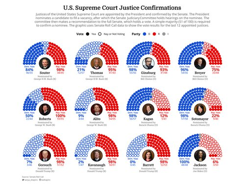{fig-align="center" height=400}

## Horror Legends 
:::{.small-text}
[Nicola Rennie](https://nrennie.rbind.io/portfolio/)
:::

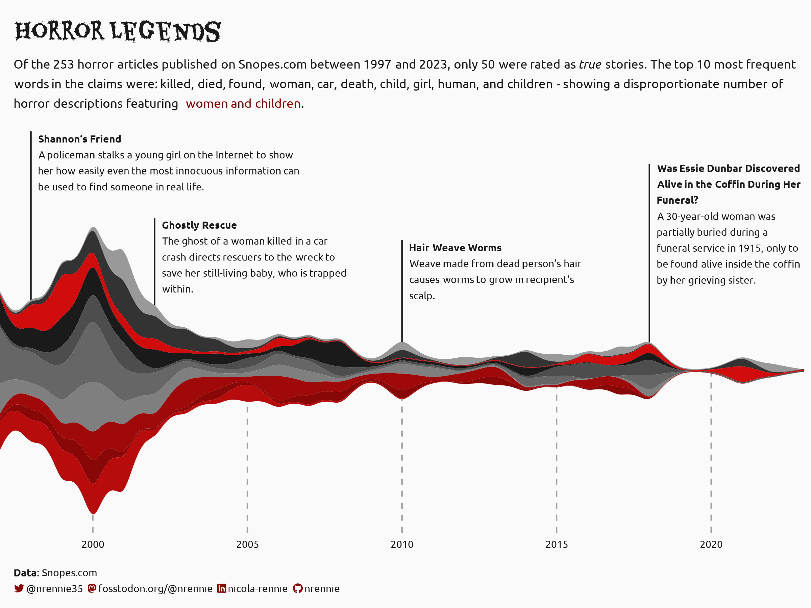{fig-align="center" height=500}

## The Great British Bake Off
:::{.small-text}
[Cara Thompson](https://www.cararthompson.com/)
:::

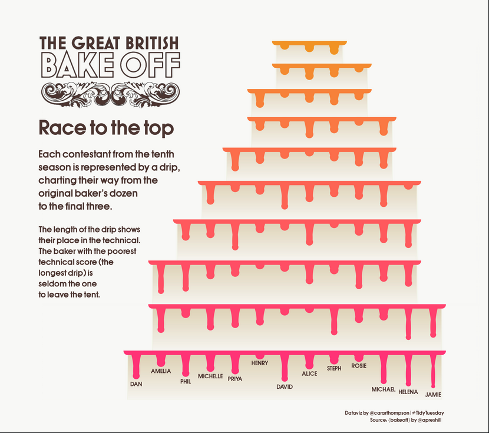{fig-align="center" height=500}

## Palmer Penguins 
:::{.small-text}
[Georgios Karamanis](https://karaman.is/)
:::

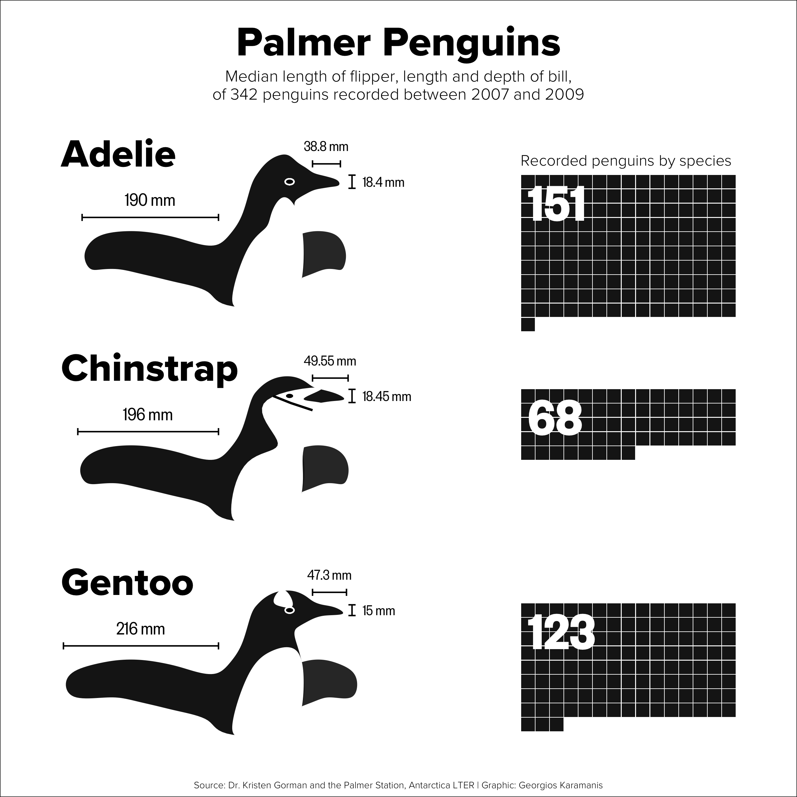{fig-align="center" height=500}

